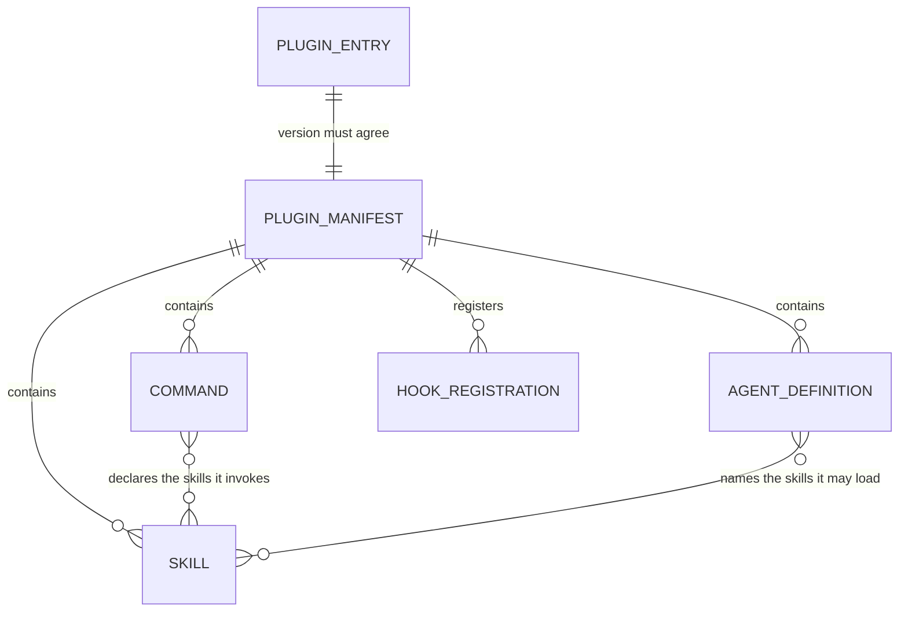

# Data and AI
<!-- contract: references/package-contract-02-architecture.md#data-and-ai -->

Two facts frame this document, and both are unusual enough to state before any table.

**The marketplace holds no user data and runs no database.** It has no runtime process. Every shipped artifact is Markdown, JSON, or shell. Each one executes inside the operator's own Claude Code session [EV-0044]. What state exists is agent-authored: files in this repository and files on the operator's machine. Sections that would describe a data layer are `N/A` with the reason, not omitted.

**It is an AI system of an unusual kind.** The tracked tree holds 71 `SKILL.md` files, 61 command definitions, and 29 agent definitions [EV-0093]. These are prompts that a model reads and acts on. The plugins invoke no model at an operator's runtime [EV-0044]. Development of the flow plugin does invoke paid models: `plugins/flow/evals/` holds a correctness evaluation harness of 4 cases and 82 tracked files [EV-0095]. The AI risk section below is written against that shape.

## Data model

| Entity | Definition | Owning component | Store | Key | Relationships | Evidence |
|---|---|---|---|---|---|---|
| Plugin entry | One installable unit advertised in the manifest | `marketplace.json` | git | `name` | Points to one source: a repository-relative path, or a pinned external source | [EV-0057], [EV-0058] |
| Plugin manifest | A plugin's own identity record | `plugins/*/.claude-plugin/plugin.json` | git | `name` | Must agree with its marketplace entry's `version` | [EV-0064] |
| Skill | One `SKILL.md`: frontmatter plus body | the plugin | git | directory name | Belongs to one plugin; referenced by commands and agents | [EV-0093] |
| Command | One Markdown file invoked as `/plugin:name` | the plugin | git | filename | Declares the skills it invokes | [EV-0093] |
| Agent definition | A subagent's system prompt, tool list, and skill list | the plugin | git | filename | Names the skills it may load | [EV-0093] |
| Hook registration | An event-to-script binding | `hooks/hooks.json` | git | event kind plus matcher | Points to a script under `hooks/scripts/` | [EV-0093] |
| Decision record | One journal entry written by the flow plugin | `.decisions/` | git | filename | 21 records tracked in this repository | [EV-0169] |

Every entity above is a file in git. There is no database, no serialization format beyond JSON and YAML frontmatter, and no identifier that outlives a commit.

## Stores

| Store | Technology | Data held | Owner | Residency | Classification | Retention | Lifecycle | Evidence |
|---|---|---|---|---|---|---|---|---|
| This git repository | git / GitHub | All plugin content and history | Daniel Bentes | GitHub, public | Public | indefinite | Append-only history; `main` carried no protection as of 2026-07-26 | [EV-0016], [EV-0044] |
| GitHub Releases | GitHub | Release tags and desktop-skill ZIP assets | Daniel Bentes | GitHub, public | Public | indefinite | v4.9.0 and v4.10.0 published 2026-09-10 | [EV-0066] |
| `docs/dossier/` | git | This documentation package, 24 files carrying headers | Daniel Bentes | GitHub, public | Public | indefinite | Rewritten by each refresh run | [EV-0088] |
| `.decisions/` | git | 21 decision records written by the flow plugin | Daniel Bentes | GitHub, public | Public | indefinite | Appended during development | [EV-0169] |
| `.dossier/runs/` | Local filesystem, untracked | 3 dossier run records, all dated 2026-07-26 | Daniel Bentes | The maintainer's machine | Internal | not defined | Written per run | [EV-0124] |
| Untracked plugin residue | Local filesystem | `plugins/agent-capability-standard/`, 42 `SKILL.md` files | The operator | The maintainer's machine | Public content | Until deleted by hand | Left behind by submodule removal; gitignored | [EV-0060], [EV-0094] |
| Operator's plugin cache | Local filesystem | A copy of installed plugins | The operator | The operator's machine | Public content | Until uninstalled; refreshed by `autoUpdate` | Not controlled by this project | [EV-0051], [EV-0052] |

**No store owned by this project holds personal data, credentials, customer data, or telemetry.** There is nowhere for such data to be held [EV-0044].

Unknown: whether the flow plugin's `.flow/` run and goal directories are written into a consuming repository, and what they hold. No ledger row covers them (AQ-0016).

## Sources, sinks, and lineage

| Flow | Source | Transformation | Sink | Trigger | Synchronization | Evidence |
|---|---|---|---|---|---|---|
| Publish | Maintainer's working tree | none | `main` | `git push` | Immediate; ungated as of 2026-07-26 | [EV-0016] |
| Distribute | `main` | none | Operator's plugin cache | `plugin install`, or `autoUpdate` re-sync | Eventually consistent, client-scheduled | [EV-0051] |
| Desktop packaging | Every `SKILL.md` | Claude Code frontmatter stripped; references bundled; ZIP created | GitHub release assets | Release published | One-shot per release | [EV-0012] |
| External source resolution | `agent-capability-standard` at sha `9e2f65b`, `prompt-decorators` at sha `9c792fe` | none | Operator's plugin cache, directly | Every install | Pinned; the content never enters this repository | [EV-0058] |

The last row is the lineage boundary of the system. Content reaches an operator under this marketplace's name without passing through this repository. Since PR #166 the pins are checked: `scripts/check-plugin-versions.sh` reads each external source at its pinned sha and compares the advertised version [EV-0080]. It passed at HEAD with 8 plugins checked and 0 failures [EV-0127]. That result was observed by the session operator, outside this engagement's action ceiling (AQ-0012). Matching is not the same as current — the script reports a stale pin rather than failing on it [EV-0080].

The former git submodule is gone. No `.gitmodules` file exists in the tracked tree [EV-0059], and the `agent-capability-standard` entry is a pinned `github` source [EV-0058]. Any description of a `git submodule update` step for this project is out of date (CT-0005).

## Consistency, caching, indexing, and search

| Mechanism | Applies to | Behaviour | Staleness window | Invalidation | Evidence |
|---|---|---|---|---|---|
| Client marketplace clone | The whole manifest | The client keeps a local clone and re-syncs it | Client-determined; `autoUpdate: true` on the observed profile | Client-internal | [EV-0051] |
| Client plugin cache | Installed plugins | A materialized copy per installed plugin | Until the client re-syncs | Reinstall | [EV-0052] |
| Pinned external sha | Both external entries | Resolves to one fixed revision at install time | Until the pin is moved by hand | Manifest edit | [EV-0058] |

There is no index and no search. There is no cache this project controls. The two client rows were observed on the assessment machine on 2026-07-26 and have not been re-checked since.

| Transactional boundary | Spans | What is not atomic across it | Compensation | Evidence |
|---|---|---|---|---|
| A single git commit | Every file changed together | Nothing within one commit | N/A | [EV-0034] |
| A version bump | `plugin.json` and the matching `marketplace.json` entry | Two files. Nothing forces both to change in one commit | CI detects the mismatch afterwards | [EV-0064], [EV-0081] |
| A release | Tag, GitHub release, and `marketplace.json` `metadata.version` | Three separate acts | Publish the tag, or revert the manifest | [EV-0057], [EV-0066] |

The version-bump row is no longer an unguarded hazard. The pair is compared on every pull request and push touching the manifest, on a weekly cron, and on manual dispatch [EV-0081]. The guard is after the fact rather than atomic: a commit can land with the two files disagreeing, and CI then fails.

## Migrations, backup, restore, archival, deletion, and retention

| Operation | Procedure | Frequency | Last executed | Verified how | Reversible | Evidence |
|---|---|---|---|---|---|---|
| Migration | N/A — no schema and no persisted data exist to migrate | — | — | — | — | [EV-0044] |
| Backup | N/A for the project. The repository is hosted on GitHub and cloned by every installer. That is redundancy, not a backup policy | — | — | — | — | [EV-0044] |
| Restore | `git revert` or `git reset` on a branch | as needed | not measured | Working-tree comparison | yes | [EV-0034] |
| Archival | N/A | — | — | — | — | [EV-0044] |
| Deletion | N/A — no personal or customer data exists to delete, and no deletion request can arise | — | — | — | — | [EV-0044] |

No backup or restore test has been recorded, and none is meaningful here: the recovery procedure for this project is `git clone`.

## Analytics and reporting

| Pipeline | Source | Destination | Schedule | Owner | Data classification | Evidence |
|---|---|---|---|---|---|---|
| N/A | — | — | — | — | — | No analytics pipeline exists. The project collects no usage data (AQ-0004) [EV-0044] |

The consequence deserves stating. **There is no measurement of whether any plugin is used, by whom, or whether it helps**. Every quality signal in this package is a property of the artifacts, with one exception. The flow plugin's eval harness measures model behaviour under its own prompts, on cases the harness itself defines [EV-0095].

## Sensitive and regulated data

| Data class | Examples (categories, never values) | Where stored | Where transits | Legal basis | Controls | Evidence |
|---|---|---|---|---|---|---|
| none held by the project | — | — | — | — | — | [EV-0044], [EV-0037] |
| Credential patterns, not values | Regular expressions matching API key and private-key formats | flow and dossier hook scripts and their test fixtures | never | N/A | These are detectors. `dossier-claim-scan.sh` redacts a matched value before reporting it | [EV-0037], [EV-0039] |
| Operator data reachable at runtime | Anything on the operator's machine a hook could read | not stored by this project | not transmitted by this project | N/A | Partial. Hooks run with the operator's privileges; every script is readable plain text before install | [EV-0093], [EV-0007] |

The third row is the honest position on sensitive data. The project holds none, and ships code that could reach any of it on an operator's machine.

**Required determination — does any sensitive class reach logs, caches, search indexes, backups, or analytics?** The project operates none of those stores [EV-0044]. There is no index, no search, no analytics pipeline, and no backup system. The only cache in the picture is the operator's own plugin cache, which holds public plugin content [EV-0052].

One control does bound the dossier plugin inside this repository. The resolved action ceiling sets `readSecrets`, `writeOutsideOutputRoot`, `networkAccess`, `runSecurityScan` and `runCodeQualityScan` to false. Only `runTests` is true [EV-0077]. That ceiling governs dossier's own agents. It does not govern the flow plugin, and it does not govern an operator's session.

## Data quality

| Control | What it checks | Where it runs | On failure | Coverage gap | Evidence |
|---|---|---|---|---|---|
| flow test suite | 2336 assertions over flow's structure and script behaviour | Locally and in `flow-tests.yml` | Non-zero exit; advisory, since no check is required for merge | Covers only flow | [EV-0098], [EV-0016] |
| dossier test suite | 1951 assertions, including frontmatter shape and script portability | Locally and in `dossier-tests.yml` | Non-zero exit; advisory | Covers only dossier | [EV-0107] |
| Linux CI confirmation | Both suites plus the manifest check, green on `ubuntu-latest` | GitHub Actions, on every merge in this range | Run marked failed | Operator-observed read, outside the action ceiling (AQ-0012) | [EV-0126] |
| Manifest validation | Every entry's advertised version against its source's `plugin.json` | `marketplace-manifest.yml`, on push, pull request, weekly cron | Non-zero exit | A pin that is stale but self-consistent still passes | [EV-0080], [EV-0081], [EV-0127] |
| CodeQL | Static analysis configured for `actions` and `python` | `codeql.yml` | Alerts | Does not analyse shell, the language of all 37 plugin `bin/` scripts | [EV-0063], [EV-0093] |
| README accuracy | — | nowhere | — | Total gap. Four stale facts were verified live on 2026-07-26 | [EV-0022], [EV-0023], [EV-0024], [EV-0025] |
| flow eval harness | Model output on 4 correctness cases with hidden tests and trap variants | `bin/flow-eval-run.sh`, by hand | Case verdict | Covers flow only; costs money per run | [EV-0095] |

Unknown: whether CodeQL still analyses any Python after the submodule removal. `codeql.yml` carries no `submodules:` key on its checkout step, and the only Python in the tree came from the removed source [EV-0063].

Manifest validation is no longer a gap. A statement elsewhere in this package that nothing validates the manifest is out of date (CT-0006).

## AI architecture

| Element | Description | Version | Owner | Evidence |
|---|---|---|---|---|
| Models, operator runtime | **None invoked by the plugins.** They run inside a Claude Code session whose model the operator chose and pays for | N/A | Anthropic, not this project | [EV-0044] |
| Models, development time | Reported: flow's retained eval summary names `claude-opus-5` and `claude-sonnet-5` across 105 runs | dated 2026-09-09 | Daniel Bentes | [EV-0096, R] |
| Agents | 29 agent definitions across the in-tree plugins. flow ships 9, dossier 6 | per plugin | Daniel Bentes | [EV-0093], [EV-0129] |
| Prompts | 71 skills and 61 commands. This is the product | per plugin | Daniel Bentes | [EV-0093] |
| Tools | Declared per skill via `allowed-tools` and per agent via `tools:`. The plugins define no tools of their own | per plugin | Daniel Bentes | [EV-0093] |
| Retrieval | None. Skills reference `references/*.md` by path, read as ordinary files. No embedding and no vector store | N/A | — | [EV-0093] |
| Memory | dossier's verification agents are declared `memory: none`, so independent passes cannot converge | per plugin | Daniel Bentes | [EV-0129] |
| Evaluation | flow ships a behavioural harness: 4 cases, per-case hidden tests and trap variants, 82 tracked files | new in this range | Daniel Bentes | [EV-0095] |

Reported: the harness summary records 105 runs across 2 models, 7 arms and 4 cases. It records a total cost of $184.65 and a `keep-enforce` verdict for both models [EV-0096, R]. The summary's own text calls the comparison incomplete, because not every arm has three runs on every case, and calls its reading provisional. That result was not re-executed for this package.

Inferred: no plugin other than flow carries a behavioural evaluation. The chain is that EV-0095 names only `plugins/flow/evals/`, and no ledger row records an eval harness anywhere else. This is reasoning from one row's scope, not an executed search for absence.

Unknown: how the flow 3.3.0 goal-evaluation loop works as an AI subsystem — its goal contract, its deterministic check report, its judge agent, and the model each agent resolves to. Directory listings at HEAD show the artifacts exist, but no ledger row covers them, so no claim about their behaviour belongs here (AQ-0016).

## Model and dataset provenance

| Asset | Origin | License or terms | Permitted uses | Restrictions | Evidence |
|---|---|---|---|---|---|
| Skills, commands, agents (in-tree) | Written for this repository | Apache-2.0, declared in every plugin manifest and in the root `LICENSE` | Use, modify, redistribute, with notice and change-statement obligations | Patent grant terminates on patent litigation | [EV-0019], [EV-0021] |
| `agent-capability-standard` | `synaptiai/agent-capability-standard` at sha `9e2f65b` | Apache-2.0 per its marketplace entry | Per Apache-2.0 | Contents not read from here; version match confirmed by CI | [EV-0058], [EV-0127] |
| `prompt-decorators` | `synaptiai/prompt-decorators` at sha `9c792fe` | Apache-2.0 per its marketplace entry | Per Apache-2.0 | Contents not verified from here (AQ-0005) | [EV-0058], [EV-0127] |
| Eval cases | Written for `plugins/flow/evals/`: four-stream-codec, interval-algebra, money-allocator, sliding-window-limiter | Same repository, Apache-2.0 | Per Apache-2.0 | Hidden tests and trap variants ship with the cases | [EV-0095], [EV-0021] |
| Training data | **None.** No model is trained, fine-tuned, or distilled by this project | N/A | N/A | N/A | [EV-0044] |
| Datasets | None beyond the eval cases above | N/A | N/A | N/A | [EV-0044], [EV-0095] |

## Lifecycle: training through rollback

| Stage | Process | Trigger | Owner | Artifacts retained | Evidence |
|---|---|---|---|---|---|
| Training | N/A — no model is trained | — | — | — | [EV-0044] |
| Fine-tuning | N/A | — | — | — | [EV-0044] |
| Inference, operator path | Performed by the operator's session, on the operator's account, with the model the operator selected | Operator action | The operator | Whatever the operator's client retains | [EV-0044] |
| Inference, eval path | Reported: the harness ran 105 model runs on 2026-09-09 [EV-0096, R] | Maintainer runs `bin/flow-eval-run.sh` | Daniel Bentes | A retained summary under `plugins/flow/evals/` | [EV-0095], [EV-0096] |
| Evaluation | flow only, by the harness above. Inferred: no other plugin has one | Manual | Daniel Bentes | Case results and summary | [EV-0095] |
| Monitoring | None. No telemetry is emitted or collected | — | — | — | [EV-0044] |
| Feedback | GitHub issues. 2 were open on 2026-07-26, both about shell portability | Operator files an issue | Daniel Bentes | The issue thread | [EV-0049] |
| Rollback | `git revert` plus a push. Installers pick it up on their next sync; the delay is client-controlled | Maintainer decision | Daniel Bentes | git history | [EV-0051] |

## AI risk controls

| Risk | Exposure in this system | Control | Implemented / policy-only / planned / unknown | Tested | Evidence |
|---|---|---|---|---|---|
| Prompt injection | Real. Skills instruct a model that then reads untrusted content: issue bodies, pull-request titles, diffs, third-party files | dossier's evidence bundle marks untrusted files in a `manifest.json` array, and each refresh scans those 11 files for injection patterns | implemented for dossier's refresh path. Unknown for the other plugins, none of which states a posture | Structurally, in the dossier suite. Never behaviourally | [EV-0120] |
| Data leakage through model or logs | A session reads the operator's own repository; a skill could copy sensitive content into an output file | flow's `block-secrets.sh` blocks writes matching credential patterns; dossier redacts matched values and gates `06-public/**` behind an approved claim register | implemented in 2 of the 6 in-tree plugins | Structurally | [EV-0038], [EV-0039], [EV-0093] |
| Unsafe or harmful output | Low intrinsic exposure. The plugins produce documentation, commits, and reviews, not user-facing content | None specific to the plugins | none | no | [EV-0093] |
| Excessive autonomy | The central risk of a workflow harness. flow can commit, push, open pull requests, and merge | Tiered actions, with merge and release requiring confirmation. `PreToolUse` hooks block destructive commands and force-pushes. dossier enforces a configured action ceiling | implemented in flow and dossier | Structurally, in both suites | [EV-0038], [EV-0039], [EV-0077] |
| Model drift | The operator's model changes under the plugins without notice. A new version reads the same skill and behaves differently | flow's eval harness can detect a behaviour change on its 4 cases. Nothing covers the other plugins, and no model is pinned | implemented for flow; none elsewhere | Last run 2026-09-09, Reported only | [EV-0095], [EV-0096] |
| Human oversight | Every plugin runs interactively in a human's session by default. dossier's post-merge CI path runs headless | The shipped CI template separates the `scan` job from the `policy` job. Its wider design is not established by any ledger row | unknown. The CI path has never executed end to end (AQ-0002), and no refresh workflow is installed here | Structurally only | [EV-0075], [EV-0084] |

Two rows carry the weight. Model drift moved from uncontrolled to partly measured. It covers 4 cases in 1 of 6 in-tree plugins, at $184.65 for the one retained run [EV-0095], [EV-0096, R]. The autonomy controls are verified structurally, not behaviourally. The suites prove a hook is registered and portable. They do not prove it blocks the right thing when a live model tries.

The prompt-injection scan is a negative result over an enumerated pattern set across 11 untrusted files, which is not proof that no injection exists [EV-0120]. No dossier docs-refresh workflow is installed in this repository, so that scan runs only when a refresh is driven by hand [EV-0084], [EV-0123].

## Model limitations, cost, latency, and vendor dependency

| Aspect | Current state | Measured or estimated | Fallback | Evidence |
|---|---|---|---|---|
| Known limitations | Skills consume context in the operator's session. 71 skills exist, loaded on demand rather than eagerly | estimated — never measured | Operator installs fewer plugins | [EV-0093] |
| Cost, operator path | Borne entirely by the operator. The project pays nothing and observes nothing | not measured | Operator's own budget controls | [EV-0044] |
| Cost, eval path | Reported: $184.65 for 105 runs, about $1.76 per run [EV-0096, R] | reported by the harness summary, not re-executed | Run fewer arms | [EV-0096] |
| Cost, CI path | A refresh run's cost would land on the consuming repository's key, with a per-run turn cap and no spend cap | not measured — never executed (AQ-0002) | The plugin documents the Anthropic console budget | [EV-0084] |
| Latency | `PreToolUse` hooks block the operator's tool call while they run. flow ships 14 hook scripts, dossier 5 | not measured | none | [EV-0129] |
| Vendor dependency | Total on Anthropic. The plugins are meaningless without Claude Code, whose schemas and hook contract are external | not measured | none, and none is possible | [EV-0043] |

## Reproducibility and versioning

| Artifact | Versioning scheme | Pinned where | Reproducible from | Evidence |
|---|---|---|---|---|
| In-tree plugin | semver in `plugin.json`, mirrored in `marketplace.json` | Both files, agreeing at HEAD and checked in CI | The repository commit | [EV-0064], [EV-0081] |
| Marketplace | semver in `metadata.version`, plus a git tag | 4.10.0 in the manifest; v4.10.0 published 2026-09-10 | The commit | [EV-0057], [EV-0066] |
| `agent-capability-standard` | Advertised as 1.2.0; the source pins sha `9e2f65b` | The marketplace entry | The pinned sha, which reports 1.2.0 | [EV-0058], [EV-0127] |
| `prompt-decorators` | Advertised as 0.1.1; the source pins sha `9c792fe` | The marketplace entry | The pinned sha, which reports 0.1.1 | [EV-0058], [EV-0127] |
| Desktop skill ZIPs | Attached per release tag | The release | `bash scripts/package-desktop-skills.sh --clean` | [EV-0012] |
| Eval results | Directory name carries the date and round | `plugins/flow/evals/results-2026-09-09-round2/` | Not reproducible — model versions move and each run costs money | [EV-0095], [EV-0096] |
| Session behaviour | Not versioned. The model the plugins instruct is chosen by the operator | nowhere | not reproducible | [EV-0044] |

Reproducibility improved in this range. Both external sources moved from unpinned or drifting references to fixed shas that CI resolves and compares [EV-0058], [EV-0127]. Two rows remain irreproducible, and both concern model behaviour rather than repository content. That is the boundary of what this project can pin.

## Open unknowns

| Question | Why it matters here | Register |
|---|---|---|
| What the flow 3.3.0 goal-evaluation subsystem does | It is the newest model-facing surface, and no evidence row describes it | AQ-0016 (proposed) |
| What `.flow/` holds in a consuming repository | It is agent-authored state on someone else's machine | AQ-0016 (proposed) |
| Whether CodeQL still analyses any Python | The only Python left with the removed source | [EV-0063] |
| Whether the dossier CI path works end to end | Its cost, oversight and leakage claims rest on a design, not a run | AQ-0002 |
| Whether `prompt-decorators` content matches its description | It is published to installers from this manifest | AQ-0005 |
| Whether CI results may ground this package | They were read outside the engagement's action ceiling | AQ-0012 |

## Recommendations

Recommendation: extend the eval harness beyond flow, or record that the other five in-tree plugins have no behavioural measurement. Today the position is inferred rather than stated.

Recommendation: add shell to the CodeQL language list, or record why 37 shell scripts are out of scope for static analysis.

Recommendation: write the flow goal-evaluation subsystem into the terminology register and the evidence ledger. The next refresh could then describe it rather than defer it.
