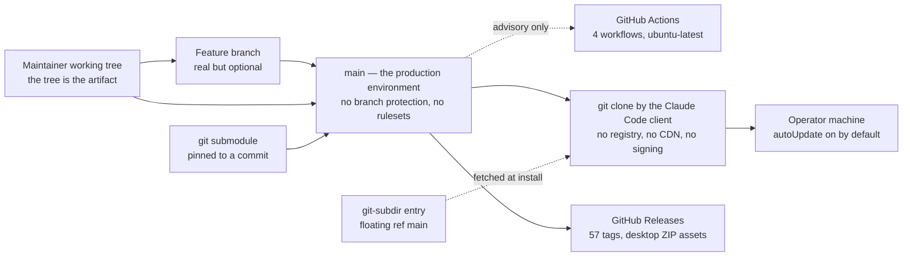

# Infrastructure and Deployment
<!-- contract: references/package-contract-02-architecture.md#infrastructure-and-deployment -->

This project provisions no infrastructure. It runs no server, no container, no database, and no scheduled job of its own beyond GitHub Actions [EV-0044]. "Deployment" here means one thing: a commit reaching `main`, from where every installing client fetches it.

That makes the interesting question narrow and answerable. **What stands between a maintainer's keystroke and every installer's machine?** The answer, verified: a personal decision to push, and nothing else [EV-0016], [EV-0017].

## Environments

| Environment | Purpose | Who can access | Data class held | Parity with production | Evidence |
|---|---|---|---|---|---|
| Maintainer's working tree | Where all changes are authored and both test suites are run | Daniel Bentes | Public content only | Identical — the tree *is* the artifact | [EV-0035] |
| Feature branch | Pre-merge staging. This assessment ran on `feature/dossier-documentation-plugin` | anyone with write access; today, one person | Public | Identical | [EV-0034] |
| `main` | **The production environment.** Whatever is here is what the next installer receives | anyone with write access, ungated | Public | It is production | [EV-0016], [EV-0051] |
| GitHub Actions runner | Ephemeral ubuntu-latest for tests, CodeQL, and release packaging | GitHub | Public content plus, on release, a write-scoped token | Not applicable | [EV-0012] |
| Operator's machine | Where installed plugins actually execute | The operator | Whatever the operator has | Not applicable — and not observable from here | [EV-0052] |

There is no test, staging, or pre-production environment, and none would be meaningful: there is nothing to deploy into. The substitute is the pull-request branch, which is real but optional — nothing requires a change to pass through one [EV-0016].

## Topology

| Layer | Configuration | Region or location | Owner | Source of truth | Evidence |
|---|---|---|---|---|---|
| Source hosting | Public GitHub repository, 572 tracked files, ~3.0 MB | GitHub | Daniel Bentes | the repository | [EV-0034] |
| Distribution | git clone performed by the Claude Code client; no registry, no CDN, no signing | GitHub | Anthropic's client | `marketplace.json` | [EV-0043], [EV-0051] |
| CI | 4 workflows on GitHub-hosted ubuntu-latest | GitHub | Daniel Bentes | `.github/workflows/` | [EV-0012] |
| Release artifacts | GitHub Releases; 57 tags, desktop ZIPs attached on publish | GitHub | Daniel Bentes | GitHub Releases | [EV-0032] |
| External plugin sources | 1 git submodule pinned to a commit; 1 `git-subdir` pinned to the floating ref `main` | GitHub | Daniel Bentes | `.gitmodules`, `marketplace.json` | [EV-0030], [EV-0031] |
| Runtime | none | the operator's machine | the operator | — | [EV-0044] |

## Infrastructure ownership and source of truth

| Resource class | Managed by | Source of truth | Drift detection | Manual changes possible | Evidence |
|---|---|---|---|---|---|
| Repository contents | git | `main` | git itself | yes — direct push, ungated | [EV-0016] |
| Repository settings — protection, rulesets, secrets | GitHub web UI and API | GitHub, **not** any file in this repository | **none** | yes | [EV-0016], [EV-0017] |
| CI workflow definitions | git | `.github/workflows/` | git | Only through a commit | [EV-0012] |
| Release artifacts | `release-desktop-skills.yml` | GitHub Releases | none | yes — assets can be uploaded or replaced by hand | [EV-0012] |
| Submodule pointer | git | `.gitmodules` plus the recorded commit | git records it; **nothing checks it against the advertised version** | yes | [EV-0031] |

The second row is the gap that matters. Every meaningful control surface for this project — whether `main` is protected, whether checks are required, which secrets exist — lives in GitHub settings that no file in the repository describes and no process reviews. There is no infrastructure-as-code, so the control state is invisible in the diff and can change without any commit.

## Resources

| Resource | Type | Environment | Sizing | Cost driver | Owner | Evidence |
|---|---|---|---|---|---|---|
| GitHub repository | hosting | production | ~3.0 MB, 570 files | free tier for a public repository | Daniel Bentes | [EV-0034] |
| GitHub Actions minutes | compute | CI | 4 workflows, path-filtered so most pushes trigger at most one | free tier for a public repository | Daniel Bentes | [EV-0012] |
| GitHub Releases storage | storage | production | 57 releases with desktop ZIP assets | free tier | Daniel Bentes | [EV-0032] |
| Anthropic API usage | compute | the operator's own account | unbounded per operator | Borne entirely by the operator | the operator | [EV-0044] |

The project's own infrastructure cost is effectively zero. The cost it *induces* — model usage in operator sessions — is unbounded, unobserved, and paid by someone else. The one place where induced cost could land on a consuming repository is dossier's post-merge CI, which caps turns per run but cannot cap spend, and has never run [EV-0045].

## Delivery flow

| Stage | Mechanism | Trigger | Approval | Duration | Reversible | Evidence |
|---|---|---|---|---|---|---|
| Build | **none.** The plugins have no build step; what is committed is what installs | — | — | — | — | [EV-0044] |
| Package | Desktop ZIPs only, from `scripts/package-desktop-skills.sh --clean` | release published | none | ~seconds | yes — re-run and re-upload | [EV-0012] |
| Artifact storage | GitHub Releases, via `gh release upload --clobber` | the same workflow | none | seconds | yes | [EV-0012] |
| Deploy | `git push` to `main`. There is no deploy step; the push *is* the deploy | maintainer decision | **none — no branch protection, no rulesets, no required checks** | immediate | by revert | [EV-0016], [EV-0017] |
| Migration | N/A — no schema, no persisted state | — | — | — | — | [EV-0044] |
| Promotion | N/A — there is one environment | — | — | — | — | [EV-0044] |
| Rollback | `git revert` plus a push. Installers pick it up on their next client sync; `autoUpdate` is `true` on the observed profile | maintainer decision | none | immediate to push; **propagation delay is client-controlled and unknown** | yes | [EV-0051] |

The rollback row carries an asymmetry worth naming: a bad change propagates on the client's schedule, and so does its fix. The project cannot expedite either, cannot observe how many installers hold the bad version, and has no channel to tell them.

## Configuration and drift control

| Environment | Configuration source | Secret source | Drift detected how | Last drift check | Evidence |
|---|---|---|---|---|---|
| Repository | GitHub settings, not in git | GitHub Actions secrets | **not detected** | never | [EV-0016], [EV-0017] |
| CI workflows | `.github/workflows/*.yml` in git | `${{ secrets.GITHUB_TOKEN }}` only; no third-party secret is configured for the existing workflows | git diff | every commit | [EV-0012] |
| Plugin defaults | each plugin's `settings.json` | none | flow and dossier suites assert their defaults | 2026-07-26 | [EV-0008], [EV-0009] |
| Operator's installed copy | The client's cache | none | none | never | [EV-0052] |

No secret is required to build, test, or release this project today. The only secret the codebase anticipates is `ANTHROPIC_API_KEY` in a *consuming* repository that scaffolds the dossier refresh workflow — which this repository has not done [EV-0045].

## Access model and privileged operations

| Operation | Who can perform it | Authentication | Approval required | Audited | Evidence |
|---|---|---|---|---|---|
| Push to `main` | anyone with write access | GitHub account | **no** | git history only | [EV-0016], [EV-0017] |
| Merge a pull request | anyone with write access | GitHub account | **no** — no required reviewers, no required checks | git history | [EV-0016] |
| Create a tag or release | anyone with write access | GitHub account | no | GitHub release log | [EV-0032] |
| Change branch protection or rulesets | repository admin | GitHub account | no | GitHub audit log, not visible in the repository | [EV-0016] |
| Move the submodule pointer | anyone with write access | GitHub account | no | git history | [EV-0031] |
| Change what `prompt-decorators` installers receive | anyone with write access to `synaptiai/prompt-decorators` | GitHub account | no | **not visible in this repository at all** | [EV-0030] |
| Upload or replace a release asset | anyone with write access, or the release workflow | GitHub account or `GITHUB_TOKEN` | no | GitHub release log | [EV-0012] |

Every row reads "no". With a single maintainer this is internally consistent — there is nobody to approve to — but the consequence is that the project has no mechanism that would survive a second contributor joining, or a credential being compromised.

The last row is the sharpest: a change in a *different* repository alters what installers of this marketplace receive, with no commit, no review, and no record here.

## Capacity, quotas, scaling, and cost

| Dimension | Current | Limit | Limit source | Scaling mechanism | Cost behaviour at scale | Evidence |
|---|---|---|---|---|---|---|
| Installers | unknown — no telemetry exists | none | — | none needed; git clone scales on GitHub's side | flat, zero to this project | [EV-0044] |
| Repository size | ~3.0 MB, 570 files | GitHub's repository limits | vendor-stated | none | flat | [EV-0034] |
| Actions minutes | 4 path-filtered workflows | free-tier minutes for public repositories | vendor-stated | none | flat | [EV-0012] |
| Release assets | 57 releases | GitHub's limits | vendor-stated | none | flat | [EV-0032] |
| Maintainer capacity | 203 commits, 62 merged pull requests, one person | one person | measured | none | **This is the binding constraint on everything else in the project** | [EV-0035], [EV-0050] |

## Backup, restore, and disaster recovery

| Item | Value | Objective or measured | Evidence |
|---|---|---|---|
| Backup scope | No formal backup exists. The repository is hosted on GitHub, cloned by every installer, and present in the maintainer's working tree | — | [EV-0044] |
| Backup frequency | N/A | — | [EV-0044] |
| Backup retention | N/A | — | [EV-0044] |
| Recovery point objective | Effectively the last push, since every clone is a full copy of history | stated objective — never formalized | [EV-0034] |
| Recovery time objective | Undefined. Recovery from a bad commit is a revert plus a push; recovery from loss of the GitHub repository has no documented procedure | stated objective | [EV-0036] |
| Last restore test | **never** | — | [EV-0036] |
| Last failover test | **never** — there is nothing to fail over to | — | [EV-0044] |
| Scope of the last test | N/A | — | [EV-0036] |

Distributed version control gives this project accidental resilience: the maintainer's machine, GitHub, and every installer's cache each hold a copy. That is redundancy, not a backup policy — nobody has verified that a full restore from any of those copies produces a working marketplace, and the GitHub-side settings (protection, secrets, release assets) are in none of them.

## Release strategy and change control

| Aspect | Current practice | Enforced by | Limitation | Evidence |
|---|---|---|---|---|
| Release strategy | Bump the plugin version in `plugin.json` and the matching `marketplace.json` entry, optionally bump `metadata.version`, tag, and publish a GitHub release. The release publication triggers desktop-skill packaging | convention documented in `.claude/CLAUDE.md`; **nothing automated verifies it** | The manifest can advertise a version with no tag behind it — as it does now, at 4.7.0 against a latest tag of v4.6.2 | [EV-0032], [EV-0033] |
| Change approval | Pull requests are used in practice — 62 merged — but are not required. Both test workflows run and neither is a required check | nothing | Any change can bypass review and CI entirely, and reach every installer on their next sync | [EV-0016], [EV-0017], [EV-0050] |
| Rollback limitations | A revert is immediate in the repository and eventual on installers' machines, on a client-controlled schedule. A published release tag can be moved, which silently changes what a pinned consumer resolves | nothing | No way to reach installers, no way to measure exposure, no way to expedite | [EV-0051] |

Sixty-two merged pull requests against 203 commits on the assessed branch shows a maintainer who reviews their own work through pull requests by habit [EV-0050], [EV-0034]. The finding is not that review is absent — it is that review is **voluntary**, so its presence tells you about one person's discipline rather than about the project's guarantees.

## Manual steps, single points of failure, and undocumented infrastructure

| Item | Kind | Impact if it fails or is forgotten | Who knows about it | Evidence |
|---|---|---|---|---|
| Bumping the version in two files | manual step | An operator installs a version different from the one advertised. Verified consistent today, by hand | Daniel Bentes | [EV-0026] |
| Bumping `metadata.version` and tagging | manual step | The manifest advertises a release that does not exist — currently true at 4.7.0 | Daniel Bentes | [EV-0033] |
| Updating the README when a plugin is added or bumped | manual step | Already failed four times: the badge says 6 plugins where 8 exist, two versions are stale, and dossier is absent entirely | Daniel Bentes | [EV-0022], [EV-0023], [EV-0024], [EV-0025] |
| Moving the submodule pointer to a tagged commit | manual step | The advertised version and the shipped tree disagree — currently 2 commits apart | Daniel Bentes | [EV-0031] |
| GitHub repository settings | undocumented infrastructure | The entire access model lives in settings no file describes, no process reviews, and no diff shows | Daniel Bentes | [EV-0016], [EV-0017] |
| Sole maintainer | single point of failure | No release, no merge, no security response, and no fix is possible without one person | Daniel Bentes | [EV-0035] |
| `synaptiai/prompt-decorators` `main` | single point of failure outside this repository | Changes what installers receive under this marketplace's name, with no signal here | Daniel Bentes | [EV-0030] |

## Environment differences

| Behaviour | Local | Test | Staging | Production | Consequence | Evidence |
|---|---|---|---|---|---|---|
| Shell | macOS bash 3.2 | ubuntu-latest bash 5 | N/A | The operator's shell, unknown | Both suites forbid bash 4+ constructs so a script that works locally works in CI — and neither environment resembles Windows | [EV-0008], [EV-0009] |
| Windows | not tested | not tested — no `windows-latest` job | N/A | Some operators are on Windows | Two open issues report real failures, and no CI leg would have caught them | [EV-0049], [EV-0012] |
| Test enforcement | run manually by the maintainer | run automatically, **advisory** | N/A | N/A | A failing suite does not stop a merge or a release | [EV-0016] |
| Plugin resolution | reads the working tree directly | not exercised | N/A | resolved by the client from `main` | The maintainer tests against files that are not the ones an installer receives; the difference is `main` versus the working tree | [EV-0051] |

The last row names an ordinary but real gap: everything in this package was verified against a working tree on an unmerged branch [AQ-0010]. No check anywhere verifies that what an installer resolves from `main` behaves as the working tree did.
