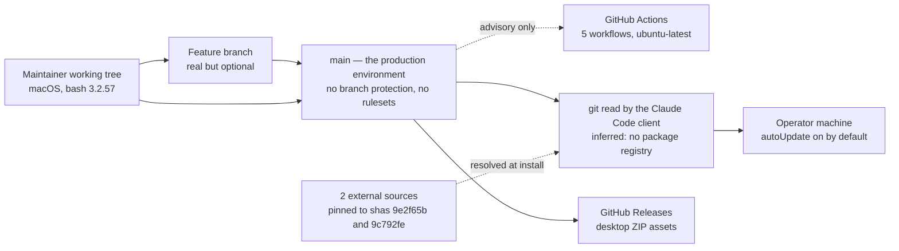

# Infrastructure and Deployment
<!-- contract: references/package-contract-02-architecture.md#infrastructure-and-deployment -->

This project provisions no infrastructure. It runs no server, no container, and no database [EV-0044]. GitHub Actions is the only execution environment the project itself operates, and it holds 5 tracked workflows: codeql, dossier-tests, flow-tests, marketplace-manifest, release-desktop-skills [EV-0123]. "Deployment" here means one thing: a commit reaching `main`, from where every installing client fetches it.

That makes the interesting question narrow and answerable. **What stands between a maintainer's keystroke and every installer's machine?**

A personal decision to push, and nothing else. Re-read live on 2026-09-10: no branch protection, no rulesets, 0 Actions secrets [EV-0131].

Four facts in this document came from GitHub reads by the session operator, not by the assessing agent [TM-0034]. The engagement's action ceiling sets `networkAccess` false. They are the Actions run history [EV-0126], the manifest version check result [EV-0127], the repository control state [EV-0131], and the repository's detected licence [EV-0132]. All are recorded under AQ-0012.

## Environments

| Environment | Purpose | Who can access | Data class held | Parity with production | Evidence |
|---|---|---|---|---|---|
| Maintainer's working tree | Where changes are authored and both shell suites are executed, on macOS 25.6 under `/bin/bash` 3.2.57 | Daniel Bentes | Public content only | Identical tree, different shell and platform | [EV-0098], [EV-0107] |
| Feature branch | Pre-merge staging. This refresh ran on `docs/dossier-refresh` | anyone with write access. Today, one person | Public | Identical | [EV-0092] |
| `main` | **The production environment.** Whatever is here is what the next installer receives | anyone with write access, ungated | Public | It is production | [EV-0131], [EV-0051] |
| GitHub Actions runner | Ephemeral `ubuntu-latest`. Both test workflows declare it, and every run in this range succeeded there | GitHub | Public repository content, plus `contents: write` on the release workflow only | Not applicable | [EV-0126], [EV-0133] |
| Operator's machine | Where installed plugins execute | The operator | Whatever the operator has | Not applicable, and not observable from here | [EV-0051] |

There is no test, staging, or pre-production environment, and none would be meaningful, because there is nothing to deploy into. The substitute is the pull-request branch, which is real but optional. Nothing requires a change to pass through one [EV-0131].

`ubuntu-latest` is the single CI execution environment. The macOS results at [EV-0098] and [EV-0107] are operator-machine observations on a different platform and shell. They are not the same evidence as the Linux runs at [EV-0126].

## Topology

| Layer | Configuration | Region or location | Owner | Source of truth | Evidence |
|---|---|---|---|---|---|
| Source hosting | Public GitHub repository. 572 tracked files, ~3.0 MB, as counted at `06b1586` | GitHub | Daniel Bentes | the repository | [EV-0034] |
| Distribution | Inferred: a git read by the Claude Code plugin client, with no package registry in the path | GitHub | Anthropic's client | `.claude-plugin/marketplace.json` | [EV-0043, I], [EV-0051] |
| CI | 5 workflows on GitHub-hosted `ubuntu-latest`, consuming 2 third-party action sources | GitHub | Daniel Bentes | `.github/workflows/` | [EV-0123], [EV-0126], [EV-0042] |
| Release artifacts | GitHub Releases. `dist/desktop/**/*.zip` attaches on `release: published` | GitHub | Daniel Bentes | GitHub Releases | [EV-0133], [EV-0066] |
| External plugin sources | `agent-capability-standard` is a `github` source pinned to sha `9e2f65b`. `prompt-decorators` is a `git-subdir` source pinned to sha `9c792fe` | GitHub | Daniel Bentes | `.claude-plugin/marketplace.json` | [EV-0058], [EV-0127] |
| Runtime | none | the operator's machine | the operator | — | [EV-0044] |

No git submodule exists. There is no `.gitmodules` file in the tracked tree [EV-0059], and `codeql.yml` carries no `submodules:` key on its checkout step [EV-0063]. A fully populated `plugins/agent-capability-standard/` directory remains on the assessment machine. It is untracked and ignored, so it is machine residue rather than repository content [EV-0060].

Inferred: the marketplace publishes to no package registry, because no workflow carries a publish step and every in-tree entry's `source` is a repository-relative path [EV-0043, I].

## Infrastructure ownership and source of truth

| Resource class | Managed by | Source of truth | Drift detection | Manual changes possible | Evidence |
|---|---|---|---|---|---|
| Repository contents | git | `main` | git itself | yes, by direct push, ungated | [EV-0131] |
| Repository settings: protection, rulesets, secrets | GitHub web UI and API | GitHub, **not** any file in this repository | **none.** Read by hand on 2026-09-10: 0 protections, 0 rulesets, 0 secrets | yes | [EV-0131] |
| CI workflow definitions | git | `.github/workflows/` | git | Only through a commit | [EV-0123] |
| Release artifacts | `release-desktop-skills.yml`, 30 lines, `permissions: contents: write` | GitHub Releases | none | yes. `gh release upload --clobber` replaces an existing asset in place | [EV-0133] |
| External source pins | git | The `sha` field on each entry in `.claude-plugin/marketplace.json` | `scripts/check-plugin-versions.sh`, in CI and on a weekly cron | yes, by a commit | [EV-0058], [EV-0081] |

The second row is the gap that matters. Every control surface for this project lives in GitHub settings that no file in the repository describes. That includes whether `main` is protected and which secrets exist. There is no infrastructure-as-code, so the control state is invisible in the diff and can change without any commit.

The fifth row changed in this range. Version drift between a marketplace entry and its source is now checked by a script, not only by hand [EV-0080].

The control state was re-read live on 2026-09-10, 45 days past the previous reads' freshness bound. Nothing had changed, and no Actions secret is configured [EV-0131].

## Resources

| Resource | Type | Environment | Sizing | Cost driver | Owner | Evidence |
|---|---|---|---|---|---|---|
| GitHub repository | hosting | production | ~3.0 MB, 572 files at `06b1586` | free tier for a public repository | Daniel Bentes | [EV-0034] |
| GitHub Actions minutes | compute | CI | 5 workflows, path-filtered so most pushes trigger a subset | free tier for a public repository | Daniel Bentes | [EV-0123], [EV-0081] |
| GitHub Releases storage | storage | production | 57 tags at 2026-07-26, plus v4.9.0 and v4.10.0 on 2026-09-10 | free tier | Daniel Bentes | [EV-0032], [EV-0066] |
| Anthropic API usage | compute | the operator's own account | unbounded per operator | Borne entirely by the operator | the operator | [EV-0044] |

The project's own infrastructure cost is close to zero. The cost it *induces*, meaning model usage in operator sessions, is unbounded, unobserved, and paid by someone else. The one place where induced cost could land on a consuming repository is the dossier post-merge refresh workflow. No such workflow is installed here [EV-0123].

## Delivery flow

| Stage | Mechanism | Trigger | Approval | Duration | Reversible | Evidence |
|---|---|---|---|---|---|---|
| Build | **none.** The plugins have no build step. What is committed is what installs | — | — | — | — | [EV-0044] |
| Package | Desktop ZIPs only, from `scripts/package-desktop-skills.sh --clean` on `ubuntu-latest` | `release: published` | none | seconds | yes, by a re-run and a re-upload | [EV-0133] |
| Artifact storage | `dist/desktop/**/*.zip` to GitHub Releases, through `gh release upload --clobber` | the same workflow | none | seconds | yes | [EV-0133] |
| Manifest check | `scripts/check-plugin-versions.sh` compares each entry against its source | manifest or plugin-manifest change, weekly cron at 06:00 UTC Monday, manual dispatch | none. Advisory | seconds | not applicable | [EV-0081] |
| Deploy | `git push` to `main`. There is no deploy step. The push *is* the deploy | maintainer decision | **none. No branch protection, no rulesets, no required checks** | immediate | by revert | [EV-0131] |
| Migration | N/A. There is no schema and no persisted state [EV-0044] | — | — | — | — | [EV-0044] |
| Promotion | N/A. There is one environment [EV-0044] | — | — | — | — | [EV-0044] |
| Rollback | `git revert` plus a push. Installers receive it on their next client sync. `autoUpdate` is `true` on the observed profile | maintainer decision | none | immediate to push. **Propagation delay is client-controlled and unknown** | yes | [EV-0051] |

The rollback row carries an asymmetry worth naming. A bad change propagates on the client's schedule, and so does its fix. The project cannot expedite either, cannot observe how many installers hold the bad version, and has no channel to reach them.

One workflow stands apart from the other four. `release-desktop-skills.yml` is the only one requesting `contents: write`, and the only one triggered by a release event rather than by a push or a pull request [EV-0133]. It interpolates `${{ github.event.release.tag_name }}` inside a `run:` body, which is the pattern this repository's own dossier CI template forbids and CT-0004 records [EV-0133].

Reproducibility of a published asset is bounded. A desktop skill package is a ZIP built from a `SKILL.md` with Claude Code frontmatter stripped [EV-0012]. The workflow rebuilds it with `--clean` from the tree at the release event [EV-0133]. Nothing signs the ZIP, and no step records which commit produced it. `--clobber` replaces an asset in place, so an asset on a release cannot be traced to a tree from the asset alone [EV-0133].

The manifest check has executed. The Marketplace Manifest run at `0e79776` concluded success [EV-0126]. A later execution of the same script reported 8 plugins checked, 0 failed, 0 unverifiable [EV-0127]. That check reports a stale pin rather than failing on one. A green result therefore does not establish that either external pin is current [EV-0127].

## Configuration and drift control

| Environment | Configuration source | Secret source | Drift detected how | Last drift check | Evidence |
|---|---|---|---|---|---|
| Repository | GitHub settings, not in git | none. 0 Actions secrets are configured | **not detected** | 2026-09-10, by hand | [EV-0131] |
| CI workflows | `.github/workflows/*.yml` in git | the ephemeral `GITHUB_TOKEN` only | git diff | every commit | [EV-0131], [EV-0133] |
| Marketplace manifest | `.claude-plugin/marketplace.json` | none | `scripts/check-plugin-versions.sh` in CI and weekly | 2026-09-10, result pass | [EV-0081], [EV-0127] |
| Plugin defaults | each plugin's `settings.json` | none | Unknown: whether either suite asserts settings defaults was not re-checked | both suites last passed 2026-09-10 | [EV-0098], [EV-0107] |
| Operator's installed copy | The client's cache | none | none | never | [EV-0051] |

No secret is required to build, test, or release this project today. The repository holds 0 Actions secrets, and the only token any workflow uses is the ephemeral `GITHUB_TOKEN` [EV-0131], [EV-0133]. The dossier refresh workflow that a *consuming* repository would scaffold anticipates `ANTHROPIC_API_KEY`, and this repository has not installed that workflow [EV-0123].

One configuration value is internally inconsistent. `.claude/settings.dossier.json` sets `dossier.ci.expectedPluginVersion` to `1.0.0` while `plugins/dossier/.claude-plugin/plugin.json` reads 1.2.0 [EV-0085], [EV-0065]. Both rows are pinned to `15bcb24`, whose blobs for these two files are unchanged at `691bcdb`.

## Access model and privileged operations

| Operation | Who can perform it | Authentication | Approval required | Audited | Evidence |
|---|---|---|---|---|---|
| Push to `main` | anyone with write access | GitHub account | **no** | git history only | [EV-0131] |
| Merge a pull request | anyone with write access | GitHub account | **no.** No required reviewers, no required checks | git history | [EV-0131] |
| Create a tag or release | anyone with write access | GitHub account | no. Publishing a release starts the packaging workflow | GitHub release log | [EV-0133], [EV-0066] |
| Change branch protection or rulesets | repository admin | GitHub account | no | GitHub audit log, not visible in the repository | [EV-0131] |
| Move an external source pin | anyone with write access | GitHub account | no. The manifest check verifies the pin resolves, and does not gate the merge | git history | [EV-0058], [EV-0081] |
| Upload or replace a release asset | anyone with write access, or the release workflow | GitHub account, or the workflow's `contents: write` `GITHUB_TOKEN` | no | GitHub release log | [EV-0133], [EV-0032] |

Every row reads "no". With a single maintainer this is internally consistent, because there is nobody to approve to. The consequence is that the project has no mechanism that would survive a second contributor joining, or a credential being compromised.

The fifth row is the one that improved in this range. Both external entries are now pinned to a commit sha rather than to a floating ref [EV-0058]. Both resolved and matched their advertised versions when the check ran [EV-0127].

## Capacity, quotas, scaling, and cost

| Dimension | Current | Limit | Limit source | Scaling mechanism | Cost behaviour at scale | Evidence |
|---|---|---|---|---|---|---|
| Installers | unknown. No telemetry exists | none | — | none needed. A git read scales on GitHub's side | flat, zero to this project | [EV-0044], [AQ-0004] |
| Repository size | ~3.0 MB, 572 files at `06b1586` | GitHub's repository limits | vendor-stated | none | flat | [EV-0034] |
| Actions minutes | 5 path-filtered workflows | free-tier minutes for public repositories | vendor-stated | none | flat | [EV-0123], [EV-0081] |
| Release assets | 57 tags at 2026-07-26, plus 2 releases on 2026-09-10 | GitHub's limits | vendor-stated | none | flat | [EV-0032], [EV-0066] |
| Maintainer capacity | 370 commits across all refs under one author identity | one person | measured | none | **This is the binding constraint on everything else** | [EV-0035] |

## Backup, restore, and disaster recovery

| Item | Value | Objective or measured | Evidence |
|---|---|---|---|
| Backup scope | No formal backup exists. The repository is hosted on GitHub, read by every installer, and present in the maintainer's working tree | — | [EV-0044] |
| Backup frequency | N/A. There is no backup process to schedule | — | [EV-0044] |
| Backup retention | N/A. There is no backup process to retain from | — | [EV-0044] |
| Recovery point objective | Effectively the last push, because every clone is a full copy of history | stated objective, never formalized | [EV-0034] |
| Recovery time objective | Undefined. Recovery from a bad commit is a revert plus a push. Recovery from loss of the GitHub repository has no documented procedure | stated objective | [EV-0036] |
| Last restore test | **never** | — | [EV-0036] |
| Last failover test | **never.** There is nothing to fail over to | — | [EV-0044] |
| Scope of the last test | N/A. No restore or failover test has been performed | — | [EV-0036] |

Distributed version control gives this project accidental resilience. The maintainer's machine, GitHub, and every installer's cache each hold a copy. That is redundancy, not a backup policy. Nobody has verified that a full restore from any copy produces a working marketplace, and the GitHub-side settings are in none of them.

## Release strategy and change control

| Aspect | Current practice | Enforced by | Limitation | Evidence |
|---|---|---|---|---|
| Release strategy | Bump the plugin version in `plugin.json` and the matching `marketplace.json` entry, bump `metadata.version`, tag, and publish a GitHub release. Publication triggers desktop-skill packaging | Convention in `.claude/CLAUDE.md`, plus `scripts/check-plugin-versions.sh` on manifest changes and weekly | The check compares advertised versions against sources. It does not verify that a tag exists behind `metadata.version` | [EV-0081], [EV-0080] |
| Version consistency | Manifest metadata reads 4.10.0, and releases v4.9.0 and v4.10.0 were published on 2026-09-10. Every in-tree entry matches its own `plugin.json` | `scripts/check-plugin-versions.sh` | The check reports a stale pin rather than failing on it, so a green result is not proof that a pin is current | [EV-0057], [EV-0066], [EV-0064], [EV-0127] |
| Change approval | Pull requests are used in practice, but are not required. All 5 workflows run and none is a required check | nothing | Any change can bypass review and CI, and reach every installer on their next sync | [EV-0131], [EV-0123] |
| Rollback limitations | A revert is immediate in the repository and eventual on installers' machines, on a client-controlled schedule. A published release tag can be moved, which changes what a pinned consumer resolves | nothing | No way to reach installers, no way to measure exposure, no way to expedite | [EV-0051] |

At `06b1586` the branch held 62 merged pull requests against 193 commits [EV-0050], [EV-0034]. That describes a maintainer who reviews their own work by habit. The finding is not that review is absent. It is that review is **voluntary**, so its presence describes one person's discipline rather than a project guarantee.

CI has a matching shape. Every Actions run across this refresh's range succeeded on Linux, covering both test workflows, the manifest check, and CodeQL [EV-0126]. None of those runs was required to succeed before the commits reached `main` [EV-0131].

## Manual steps, single points of failure, and undocumented infrastructure

| Item | Kind | Impact if it fails or is forgotten | Who knows about it | Evidence |
|---|---|---|---|---|
| Bumping the version in two files | manual step, now checked | An operator installs a version different from the one advertised. CI compares the pair on every manifest change | Daniel Bentes | [EV-0081], [EV-0127] |
| Bumping `metadata.version` and tagging | manual step, unchecked | The manifest advertises a release that does not exist. Aligned at 4.10.0 on 2026-09-10 | Daniel Bentes | [EV-0057], [EV-0066] |
| Updating the README when a plugin is added or bumped | manual step | Failed four times as counted at `06b1586`. The badge said 6 plugins where 8 exist, two versions were stale, and dossier was absent | Daniel Bentes | [EV-0022], [EV-0023], [EV-0024], [EV-0025] |
| Moving an external source pin to a released commit | manual step | The advertised version and the shipped tree could disagree. Both matched when the check last ran | Daniel Bentes | [EV-0058], [EV-0127] |
| GitHub repository settings | undocumented infrastructure | The whole access model lives in settings no file describes, no process reviews, and no diff shows | Daniel Bentes | [EV-0131] |
| Sole maintainer | single point of failure | No release, no merge, no security response, and no fix is possible without one person | Daniel Bentes | [EV-0035] |
| `synaptiai/prompt-decorators` | single point of failure outside this repository | Its contents are not versioned here. The entry now pins sha `9c792fe`, so upstream movement does not reach installers without a commit here | Daniel Bentes | [EV-0058], [AQ-0005] |

## Environment differences

| Behaviour | Local | CI | Staging | Production | Consequence | Evidence |
|---|---|---|---|---|---|---|
| Shell and platform | macOS 25.6, `/bin/bash` 3.2.57 | `ubuntu-latest` | N/A. No staging environment exists | The operator's shell, unknown | Both suites avoid bash 4+ constructs. Both platforms have now been exercised separately | [EV-0098], [EV-0107], [EV-0126] |
| Suite result | flow 2336 pass 0 fail, dossier 1951 pass 0 fail, on the operator's machine | Every run in the range concluded success on Linux | N/A | N/A | These are two independent observations, not one. Neither describes Windows | [EV-0098], [EV-0107], [EV-0126] |
| Windows | not tested | Both test workflows declare `ubuntu-latest`. Runners for the other 3 workflows are not recorded | N/A | Some operators are on Windows | Two issues reported real failures as of 2026-07-26 | [EV-0049], [EV-0126], [AQ-0008] |
| Test enforcement | executed by the maintainer | executed automatically, **advisory** | N/A | N/A | A failing suite does not stop a merge or a release | [EV-0131] |
| Plugin resolution | reads the working tree directly | not exercised | N/A | resolved by the client from `main` | The maintainer tests files that are not the ones an installer receives | [EV-0051] |

The last row names an ordinary but real gap. This package was produced against a working tree on an unmerged branch [AQ-0010], [EV-0092]. No check anywhere verifies that what an installer resolves from `main` behaves as the working tree did.

Unknown: whether a first-time install on a clean Claude Code profile succeeds. Resolution and install are observed on one already-configured machine only [AQ-0003], [EV-0051].

## What is planned but not implemented

Recommendation: enable branch protection on `main` requiring both test workflows, so that the green Linux results at [EV-0126] gate a merge instead of following it. No protection and no ruleset exists today [EV-0131].

Recommendation: add a Windows CI leg, so that the portability defects reported in [EV-0049] have a check that can observe them. Both test workflows declare `ubuntu-latest` today [EV-0126].

No dossier documentation-refresh workflow is installed in this repository [EV-0123]. Nothing in the repository states an intention to install one.
