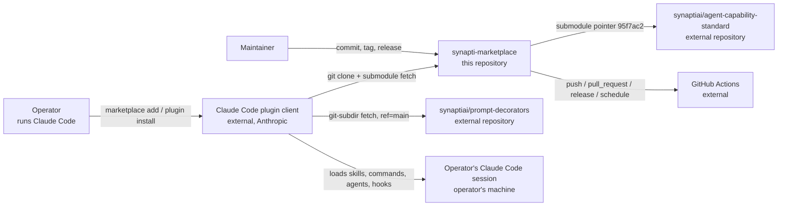
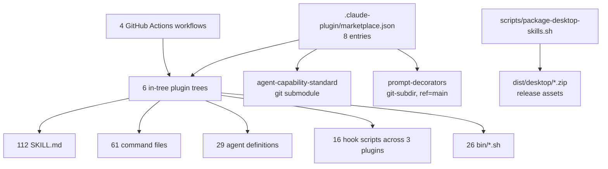
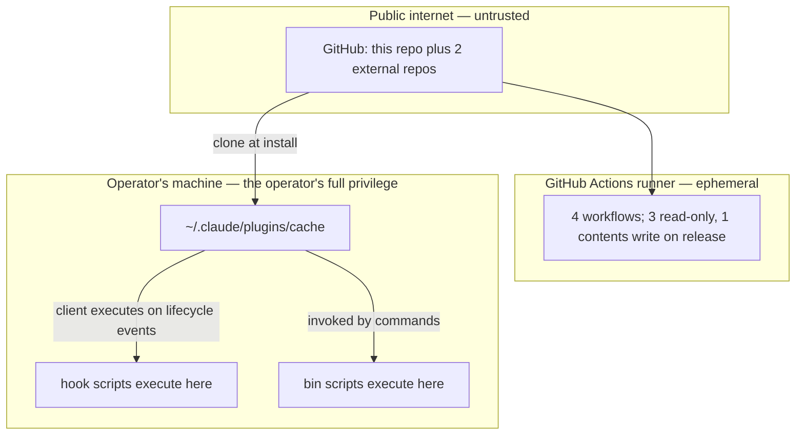

# System Architecture
<!-- contract: references/package-contract-02-architecture.md#system-architecture -->

Every node and every connection in the diagrams below is supported by evidence. Connections that are inferred rather than observed are labelled as inferred in the diagram and in the accompanying table.

The central architectural fact, which determines almost everything else in this document: **the marketplace has no runtime of its own** [EV-0044]. It is a manifest plus a content tree. All execution happens inside the operator's Claude Code session, on the operator's machine, under the operator's credentials. Sections that would describe servers, tenancy, or state consistency are therefore `N/A` with the reason stated, not omitted.

## Goals, constraints, and quality attributes

| Quality attribute | Target or constraint | Driven by | Evidence | State |
|---|---|---|---|---|
| Installability | An operator adds one marketplace and installs plugins by name; resolution is performed entirely by the Claude Code client | The client's plugin model | [EV-0051], [EV-0052] | V |
| Auditability of executed code | Every executable artifact is plain shell or Markdown a reader can read before installing — 26 shell scripts, no compiled binaries, no minified bundles | Deliberate; the plugins ask for trust to run hooks | [EV-0007], [EV-0044] | V |
| Portability of shipped scripts | Scripts must run on macOS bash 3.2 and on ubuntu-latest bash 5 | Asserted in the flow and dossier suites, which fail on `declare -A`, `readarray`, `mapfile`, and bash 4 case conversion | [EV-0008], [EV-0009] | V |
| Portability to Windows | Not met. Two open issues report failures under Windows and Git Bash, and no workflow runs on Windows | Reported by users, not designed for | [EV-0049], [EV-0012] | R |
| Reproducibility of an install | In-tree plugins resolve to the commit the marketplace is read at. The `prompt-decorators` entry resolves to whatever `main` points to at install time | Manifest source kinds | [EV-0030] | V |
| Zero telemetry | The marketplace collects nothing; there is no endpoint to collect to | Follows from having no runtime | [EV-0044] | V |

| Architectural constraint | Origin | Consequence | Evidence |
|---|---|---|---|
| No runtime process may be introduced | technical | Reliability, availability, and capacity questions have no subject. Assurance effort goes into script correctness and hook safety instead | [EV-0044] |
| Hooks execute on the operator's machine without being invoked | technical | The trust boundary that matters is install-time, not run-time. This is why the hook inventory is disclosed publicly | [EV-0040] |
| The Claude Code client is not built or controlled by this project | organizational | The manifest schema, resolution order, and cache layout are external contracts that can change without notice | [EV-0043] |
| Distribution is git, not a package registry | technical | No integrity signature and no immutable version artifact. A tag can be moved; a `main` ref moves by design | [EV-0030], [EV-0043] |
| Single maintainer | organizational | No architectural decision receives independent review before it ships | [EV-0035] |

## System context

| Edge | From | To | Carries | Protocol | Trust | Evidence |
|---|---|---|---|---|---|---|
| E1 | Operator | Claude Code plugin client | Marketplace name and plugin names | Local CLI | trusted | [EV-0051] |
| E2 | Claude Code plugin client | This repository | Full clone including submodules | git over HTTPS | authenticated (public read) | [EV-0051], [EV-0053] |
| E3 | Claude Code plugin client | `synaptiai/prompt-decorators` | The `claude-code-plugin` subdirectory at ref `main` | git over HTTPS | authenticated (public read) | [EV-0030] |
| E4 | This repository | `synaptiai/agent-capability-standard` | A pinned commit, `95f7ac2` | git submodule | authenticated (public read) | [EV-0031] |
| E5 | Claude Code plugin client | Operator's session | Skill text, command text, agent definitions, and **executable hook scripts** | Local filesystem | **trusted by the operator, unverified by this project** | [EV-0040], [EV-0052] |
| E6 | This repository | GitHub Actions | Workflow definitions and repository contents | GitHub-internal | authenticated | [EV-0012] |
| E7 | Maintainer | This repository | Commits, tags, releases | git over HTTPS | authenticated | [EV-0035] |

Edge E5 is the one that matters. Everything else moves text; E5 delivers shell scripts that a client will execute on a personal machine at defined lifecycle points, without the operator invoking them.

## Container view

| Container | Responsibility | Runtime | Deployment unit | State it owns | Criticality | Evidence |
|---|---|---|---|---|---|---|
| `marketplace.json` | Single discovery manifest. Names 8 plugins and how to resolve each | none — read by the client | the repository | none | critical | [EV-0001] |
| In-tree plugin trees (6) | The plugins whose files are versioned here | none | the repository | none | critical | [EV-0003] |
| `agent-capability-standard` submodule | 42 skills, Apache-2.0, carries the only dependency manifest | Python 3.10+ for its test suite only | pinned commit | none | medium | [EV-0031], [EV-0041] |
| `prompt-decorators` external source | A plugin resolved from another repository at ref `main` | none | that repository's `main` | none | medium | [EV-0030] |
| Hook scripts (16 across 3 plugins) | Shell executed by the client on the operator's machine at lifecycle points | bash on the operator's machine | installed plugin cache | none | **critical to trust** | [EV-0038], [EV-0039], [EV-0040] |
| `bin/*.sh` (26) | Helper scripts that skills and commands invoke deliberately | bash on the operator's machine | installed plugin cache | none | high | [EV-0007] |
| GitHub Actions workflows (4) | Test both shell suites, run CodeQL, package desktop skills on release | ubuntu-latest | the repository | Actions run history | high | [EV-0012] |
| `package-desktop-skills.sh` | Builds ZIPs from `SKILL.md` files with Claude Code frontmatter stripped, attached to releases | bash on a runner | release assets | none | low | [EV-0012] |

## Runtime and control flows

| Flow | Trigger | Path | Synchronous or asynchronous | Failure behaviour | Evidence |
|---|---|---|---|---|---|
| Marketplace add | Operator runs `claude plugin marketplace add` | Client clones to `~/.claude/plugins/marketplaces/<name>` and records the source in `known_marketplaces.json` with `autoUpdate: true` | synchronous | Unobserved for a clean profile (AQ-0003) | [EV-0051] |
| Plugin install | Operator runs `claude plugin install <name>` | Client reads the manifest entry, resolves its `source`, materializes the plugin under `~/.claude/plugins/cache/<marketplace>/<plugin>`, records it in `installed_plugins.json` | synchronous | Unobserved | [EV-0052] |
| Skill or command invocation | Operator types `/plugin:command`, or a skill trigger fires | Client loads the Markdown into session context; `bin/` scripts run only where a command's `!` block or the operator's tools invoke them | synchronous | Command text is inert on failure; a missing `bin/` script surfaces as a command-level error | [EV-0005], [EV-0007] |
| Hook execution | A registered lifecycle event — `PreToolUse`, `PostToolUse`, `SessionEnd`, `Stop`, `TaskCompleted`, `TeammateIdle` | Client executes the registered script on the operator's machine | synchronous, blocking for `PreToolUse` | A `PreToolUse` hook that exits non-zero blocks the tool call — the intended mechanism for `block-destructive.sh` and `block-secrets.sh` | [EV-0038], [EV-0040] |
| CI test run | `push` or `pull_request` touching the matching paths | ubuntu-latest executes `tests/run.sh` under `permissions: contents: read` | asynchronous | Advisory only — no required status check exists, so a failing run does not block a merge | [EV-0013], [EV-0016] |
| Release packaging | A GitHub release is published | Runner executes `package-desktop-skills.sh --clean` and uploads ZIPs with `contents: write` | asynchronous | Failure leaves the release without desktop assets; nothing else is affected | [EV-0012] |
| Auto-update | Client-internal schedule | The client re-syncs the marketplace clone; `autoUpdate` is `true` on the observed profile | asynchronous | Not controlled by this project | [EV-0051] |

### Primary flow walkthrough

An operator installs `flow` and it begins blocking their destructive commands. The full path:

1. `claude plugin marketplace add synaptiai/synapti-marketplace`. The client clones this repository including submodules — the assessment machine's copy has the `agent-capability-standard` path populated with 30 entries, so the submodule fetch does happen [EV-0053]. It writes an entry to `known_marketplaces.json` recording `source: {github, synaptiai/synapti-marketplace}` and `autoUpdate: true` [EV-0051].
2. `claude plugin install flow`. The client reads the `flow` entry, whose `source` is the repository-relative path `./plugins/flow`, and materializes it under `~/.claude/plugins/cache/synapti-marketplace/flow` [EV-0052].
3. The client reads `plugins/flow/hooks/hooks.json`, which registers 6 event kinds [EV-0038]. From this moment the operator's session behaviour has changed, and no command was invoked to cause it.
4. The operator asks Claude to delete a directory. The client fires `PreToolUse`, which runs `block-destructive.sh` on the operator's machine. The script inspects the pending tool call and exits non-zero. The tool call is blocked.
5. **Failure paths at each step.** The clone can fail on network or rate limit — the client's concern, not observable here. The manifest can be malformed, which would break discovery for all 8 plugins at once, and nothing in CI validates it. A hook script can be non-executable, or use a bash 4 construct on macOS bash 3.2 — the flow and dossier suites test exactly this, which is why those two suites exist and why the five untested plugins are a real gap [EV-0010]. A hook can be slow, and `PreToolUse` blocks.

The transition with no test coverage anywhere is step 1 into step 2: no automated check validates that `marketplace.json` parses, that every `source` resolves, or that every entry's version matches its `plugin.json`. That consistency was verified by hand during this assessment [EV-0026] and holds today; nothing keeps it holding.

## Trust boundaries

| Boundary | Separates | Crossing mechanism | Authentication | Authorization | Evidence |
|---|---|---|---|---|---|
| B1 — install | Public repository content from the operator's machine | `git clone` performed by the Claude Code client | Public read; no signature, no checksum, no provenance attestation | The operator's decision to install. Nothing narrower | [EV-0051], [EV-0052] |
| B2 — execution | Installed plugin files from the operator's shell | The client executes hook scripts on registered lifecycle events, and `bin/` scripts when a command calls them | none | The scripts inherit the operator's full user privileges. There is no sandbox | [EV-0038], [EV-0039], [EV-0040] |
| B3 — supply | This repository from the two external plugin sources | git submodule (pinned commit) and `git-subdir` (floating ref `main`) | Public read | The submodule is pinned and therefore reviewable; `prompt-decorators` is not — its content can change between two installs with no change here | [EV-0030], [EV-0031] |
| B4 — CI | Repository content from the Actions token | Workflow `permissions` blocks | GitHub OIDC | `contents: read` for both test workflows, `contents: write` for release packaging, and **`codeql.yml` declares no top-level permissions**, falling back to the repository default | [EV-0013], [EV-0014] |
| B5 — write on `main` | Any commit from the released default branch | `git push` | GitHub account | **None.** No branch protection, no rulesets, no required checks | [EV-0016], [EV-0017] |

B2 deserves a reviewer's attention, and it is one-way: once installed, a plugin's hooks run with the operator's privileges and nothing in this project constrains them. The mitigations are that every script is readable plain text [EV-0007], that two of the three hook-shipping plugins carry suites totalling 2,263 assertions [EV-0008], [EV-0009], and that the flow hooks' purpose is restrictive — `block-destructive.sh`, `block-secrets.sh`, `block-force-push.sh` [EV-0038].

B5 is the weakest boundary relative to its consequence: whatever is on `main` is what the next operator installs, and nothing gates the push that puts it there.

## Communication

| Interaction | Kind | Transport | Delivery guarantee | Ordering | Idempotency | Evidence |
|---|---|---|---|---|---|---|
| Marketplace resolution | synchronous | git over HTTPS | at-most-once per invocation | N/A | Idempotent — re-running `add` re-syncs the same clone | [EV-0051] |
| Plugin install | synchronous | Local filesystem copy from the clone | at-most-once | N/A | Idempotent | [EV-0052] |
| Hook invocation | synchronous, blocking | Process execution by the client | exactly-once per event | Client-determined | Not applicable — hooks inspect and permit or block; they hold no state | [EV-0038] |
| CI trigger | asynchronous | GitHub event delivery | at-least-once; GitHub may coalesce pending runs | Not guaranteed | Test workflows are pure functions of the tree, so re-running is safe | [EV-0012] |
| Release asset upload | asynchronous | `gh release upload --clobber` | at-least-once | N/A | Idempotent by `--clobber` | [EV-0012] |

No retry path in this system lacks an idempotency mechanism, because every operation is either a read or an overwrite. There are no queues, no partial writes, and no distributed state.

## State ownership and consistency

| State | Owning component | Store | Consistency model | Concurrent-write handling | Evidence |
|---|---|---|---|---|---|
| Plugin content | This repository | git | Linear history on `main` | Last write wins — no protection, no required review | [EV-0016], [EV-0017] |
| Marketplace registration | Claude Code client | `~/.claude/plugins/known_marketplaces.json` | Client-owned | Client-determined | [EV-0051] |
| Installed plugin set | Claude Code client | `~/.claude/plugins/installed_plugins.json` and `cache/` | Client-owned | Client-determined | [EV-0052] |
| Release artifacts | GitHub Releases | GitHub | Immutable per tag, but a tag can be moved | `--clobber` overwrites assets | [EV-0032] |
| Decision journal | flow plugin, in consuming repositories | `.decisions/*.md` | Append-only by convention | 11 records exist here, each with a lock file | [EV-0046] |

The project owns no runtime state. Every row above is either version-controlled content or state owned by an external system.

## Tenancy, identity, authorization, and isolation

| Aspect | Model | Enforcement point | What it does not isolate | Evidence |
|---|---|---|---|---|
| Tenancy | None. One artifact set, identical for every installer | N/A | Nothing — there are no tenants to isolate from each other | [EV-0044] |
| Identity | None inside the product. The only identities are GitHub accounts for writing and the operator's local user for running | GitHub for writes; the operating system for execution | The plugins cannot distinguish one operator from another, and do not try | [EV-0044] |
| Authorization | Write access is GitHub-account-based and **ungated** on `main`. Read access is public | GitHub | It does not gate merges, does not require review, and does not require either test workflow to pass | [EV-0016], [EV-0017] |
| Isolation | Installed plugin files sit in the operator's home directory and execute with the operator's privileges | None — the client provides no sandbox this project is aware of | **Hook scripts are not isolated from the operator's filesystem, environment variables, network, or credentials.** A hook can do anything the operator can do | [EV-0040] |

The "what it does not isolate" column carries the weight in the last row. Describing the plugins as "just Markdown and shell" would read as stronger isolation than exists.

## Failure modes and degradation

| Failure | Blast radius | Detection | Degraded behaviour | Recovery | Tested | Evidence |
|---|---|---|---|---|---|---|
| Malformed `marketplace.json` | All 8 plugins become undiscoverable at once | None automated — no schema check in CI | Discovery fails entirely | Fix and push; installers re-sync on `autoUpdate` | no | [EV-0012], [EV-0001] |
| A plugin's version disagrees with its manifest entry | One plugin installs under a wrong label | Manual only; verified by hand during this assessment | Silent — the operator gets a version they did not ask for | Correct one of the two values | no | [EV-0026] |
| Hook script fails on the operator's platform | Every session of every operator on that platform | The operator's own session errors | Sessions may be blocked or noisy | Uninstall, or wait for a fix | partially — bash 3.2 portability is tested; **Windows is not** | [EV-0008], [EV-0009], [EV-0049] |
| `prompt-decorators` upstream `main` changes or breaks | Everyone who installs that plugin from that moment on | none | The plugin installs different content than it did yesterday | Pin the entry to a tag | no | [EV-0030] |
| A bad commit reaches `main` | Every subsequent installer immediately, since `autoUpdate` is on | CI runs but is advisory | The bad state is what installs | Revert and push | no — the gate does not exist | [EV-0016], [EV-0051] |
| Submodule pointer drifts from the advertised version | `agent-capability-standard` installers | none | The operator gets a tree 2 commits past `v1.2.0` while the manifest says 1.2.0 | Move the pointer to the tag, or re-tag | no | [EV-0031] |
| CI or Actions outage | Nothing — CI is advisory | GitHub status | Merges continue unaffected | Wait | N/A | [EV-0016] |

## Patterns actually used

| Pattern | Where | Why it is there | Evidence |
|---|---|---|---|
| Manifest-driven discovery | `marketplace.json` | One file the client reads; every plugin's presence and resolution is data, not code | [EV-0001] |
| Content as artifact | 112 skills, 61 commands, 29 agents | The product *is* text loaded into a model's context; there is nothing to compile | [EV-0004], [EV-0005], [EV-0006] |
| Interceptor chain | `hooks.json` in 3 plugins | The only way to change session behaviour without the operator invoking something. Used restrictively — the flow hooks mostly block | [EV-0038], [EV-0040] |
| Settings cascade | `plugins/flow/bin/cascade-resolve.sh`, copied into dossier | Lets a project override a user default and a user override a plugin default, with environment variables on top for CI | [EV-0007] |
| Shell-out to helper scripts | 26 `bin/*.sh` | Keeps deterministic logic out of model context: the model orchestrates, the script decides | [EV-0007] |
| Structural test suites over prose artifacts | 2,263 assertions across flow and dossier | Markdown has no compiler, so frontmatter shape, cross-reference resolution, and counts are asserted in shell instead | [EV-0008], [EV-0009] |
| Vendoring by copy | `cascade-resolve.sh` and the test harness were copied from flow into dossier | Deliberate: plugins install independently and cannot depend on one another at runtime | [EV-0007] |

## Tradeoffs and rejected alternatives

| Decision | Chosen | Rejected alternative | Stated rationale | Evidence | State |
|---|---|---|---|---|---|
| Distribution mechanism | git clone by the Claude Code client | A package registry with immutable versions | No rationale is recorded anywhere in the repository. The client's plugin model is git-based, so this may not have been a decision at all | [EV-0043] | I — inferred from the absence of any registry manifest or publish step |
| External plugin sourcing | One git submodule, one `git-subdir` at `main` | Vendoring both in-tree | No record | [EV-0030], [EV-0031] | U |
| Duplicating `cascade-resolve.sh` into dossier rather than sharing it | Copy | A shared library plugin | Plugins install independently, so a runtime dependency between them cannot be assumed | [EV-0007] | R — stated in the plugin's own plan document, not in a decision record |
| Coexistence of `flow` and `gh-workflow` | Ship both, instruct operators to enable one at a time | Deprecate `gh-workflow` | Hook conflicts | `.claude/CLAUDE.md` | R |

Where no record exists the rationale is recorded as unknown rather than reconstructed. Three of the four rows are reconstructions or absences, which is itself the finding: the repository holds 11 decision records [EV-0046] and none covers an architectural choice.

## Current versus target architecture

| Aspect | Current | Target | Gap | Committed | Evidence |
|---|---|---|---|---|---|
| Merge gating | No protection on `main`; tests advisory | Required status checks on both suites | Enable branch protection | no | [EV-0016], [EV-0017] |
| Manifest validation | Verified by hand | A CI check asserting the manifest parses, every source resolves, and every version matches its `plugin.json` | One workflow step | no | [EV-0026] |
| Test coverage across plugins | 2 of 7 in-tree plugins | Every plugin carries at least a structural suite | 5 suites | no | [EV-0010] |
| Windows support | Unsupported; 2 open issues | Either supported and tested, or documented as unsupported | A `windows-latest` matrix job, or a statement in the README | no — issue #100 proposes a policy and remains open | [EV-0049] |
| External source pinning | `prompt-decorators` floats on `main` | Pinned to a tag | One manifest edit | no | [EV-0030] |
| Documentation freshness | The README carries 4 verified-stale facts | Generated from the manifest, or refreshed on merge | The dossier plugin exists to close this and has never run (AQ-0002) | no | [EV-0022], [EV-0023], [EV-0024], [EV-0025], [EV-0045] |

Every row is marked not committed, because no roadmap, milestone, or decision record commits to any of them. Listing them as targets states a gap, not a plan.

## Scalability boundaries and bottlenecks

| Boundary | Current limit | How the limit was established | Symptom on breach | Headroom | Evidence |
|---|---|---|---|---|---|
| Plugin context cost | 112 skills across 8 plugins; a session loads only what it triggers | calculated — skills load on demand, not eagerly | Context pressure in the operator's session | Unmeasured | [EV-0004] |
| Repository clone size | 3,103 KB per the GitHub API; 572 tracked files | measured | Slow first install | Large | [EV-0034] |
| Maintainer throughput | 193 commits and 62 merged pull requests by one person | measured | Review latency; no second reviewer exists at any load | None — this is the binding constraint on everything else | [EV-0035], [EV-0050] |
| CI capacity | 4 workflows, path-filtered | measured | Not approached | Large | [EV-0012] |

The only real scalability boundary in this system is the maintainer. Nothing else in it is under load.

## Cross-links

| Subject | Canonical document |
|---|---|
| Interface contracts and integration behaviour | `02-architecture/interfaces-and-integrations.md` |
| Data model, stores, and AI architecture | `02-architecture/data-and-ai.md` |
| Environments, deployment, and recovery | `02-architecture/infrastructure-and-deployment.md` |
| Threat model and controls | `03-assurance/security-privacy-and-compliance.md` |
| Objectives, measurements, and observability | `03-assurance/reliability-performance-and-observability.md` |
| Component inventory and code paths | `02-architecture/components-and-codebase.md` |
