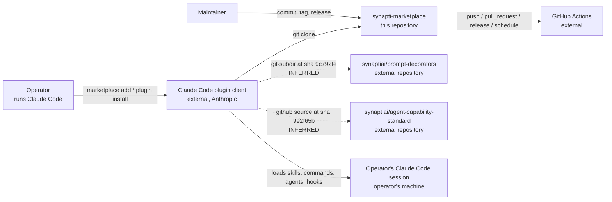
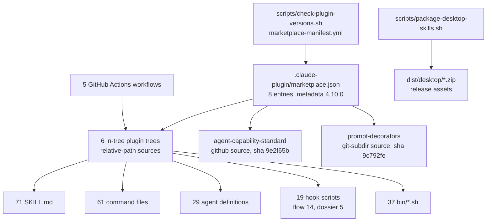
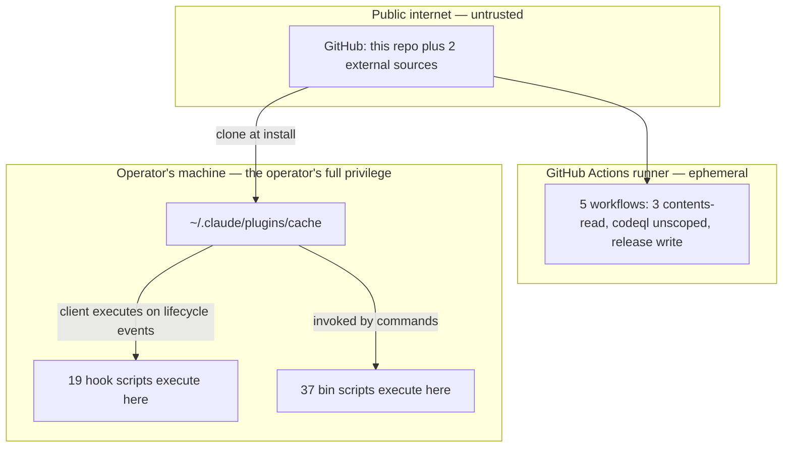

# System Architecture
<!-- contract: references/package-contract-02-architecture.md#system-architecture -->

Every node and every connection in the diagrams below is supported by evidence. Connections that are inferred rather than observed are labelled as inferred in the diagram and in the accompanying table.

The central architectural fact, which determines almost everything else here: **the marketplace has no runtime of its own** [EV-0044]. It is a manifest plus a content tree. There is no service topology, no network runtime and no deployed boundary. **The trust boundary that matters is the operator's own machine.** All execution happens inside the operator's Claude Code session, under the operator's credentials [EV-0044]. Sections that would describe servers, tenancy or state consistency are therefore `N/A` with the reason stated, not omitted.

The architecture in one line: a manifest, eight plugin entries, three source resolution mechanisms. An external client resolves and executes them locally. Hook machinery bounds what agent code may do.

## Evidence vintage

This refresh re-checked the manifest, the artifact counts, the hook inventory and the manifest check. The dispatched collectors re-checked nothing on the GitHub side. The session operator performed those reads directly.

The action ceiling did not forbid them. It sets `networkAccess` false [EV-0077], and under that setting it denies network clients and mutating `gh` verbs while permitting read-only `gh` and `git` [EV-0196]. Unknown: no evidence records why the collectors did not run those reads themselves (AQ-0012).

A second fact applies to this engagement. Both dossier enforcement hooks exit 0 unless `<outputRoot>/00-control/.scope.json` exists, and none existed here, so the ceiling was inert throughout [EV-0091], [EV-0124], [EV-0194], [EV-0195].

Citations written `[EV-pending R4-NN]` name a fact executed during the round-4 repair whose ledger row is not yet appended. Full treatment is in `03-assurance/security-privacy-and-compliance.md`.

| Claim area | Last observed | Re-checked in this refresh | Note |
|---|---|---|---|
| Manifest, sources, artifact counts | 2026-09-10 | yes | [EV-0057], [EV-0058], [EV-0093], [EV-0129] |
| Branch protection and rulesets | 2026-07-26 | no | [EV-0016], [EV-0017]. Both rows carry a 30-day freshness window that has expired |
| Open issues, merged pull requests | 2026-07-26 | no | [EV-0049], [EV-0050]. Freshness window is days |
| Tags and latest release | 2026-07-26 | no | [EV-0032]. Marketplace metadata has since moved to 4.10.0 [EV-0057] |
| Client install state on the assessment machine | 2026-07-26 | no | [EV-0051], [EV-0052]. `autoUpdate` is true, so the clone has moved since |
| Linux CI results, manifest check result | 2026-09-10 | yes, by the operator | [EV-0126], [EV-0127]. Collected by the session operator directly, not by a dispatched collector — see AQ-0012 |

## Goals, constraints, and quality attributes

| Quality attribute | Target or constraint | Driven by | Evidence | State |
|---|---|---|---|---|
| Installability | The operator adds one marketplace and installs by name. The client performs all resolution | The client's plugin model | [EV-0051] | V |
| Auditability of executed code | Every executable artifact is plain shell a reader can read before installing | Deliberate. The plugins ask for trust to run hooks | [EV-0093], [EV-0129], [EV-0044] | V |
| Portability of shipped scripts | Scripts must run on macOS bash 3.2 and on ubuntu-latest bash 5 | Both suites assert it, and both pass on each platform | [EV-0098], [EV-0107], [EV-0126] | V |
| Portability to Windows | Not met. Two open issues report failures, and no workflow runs on Windows | Reported by users, not designed for | [EV-0049], [EV-0123] | R |
| Reproducibility of an install | Both external entries resolve to a fixed sha. In-tree entries resolve to the commit the clone holds | Manifest source kinds | [EV-0058] | V |
| Manifest and version consistency | Every entry's advertised version matches its source, checked in CI | Added in this range | [EV-0080], [EV-0081], [EV-0127] | V |
| Zero telemetry | The marketplace collects nothing. There is no endpoint to collect to | Follows from having no runtime | [EV-0044] | V |

| Architectural constraint | Origin | Consequence | Evidence |
|---|---|---|---|
| No runtime process may be introduced | technical | Reliability and capacity questions have no subject. Effort goes to script correctness and hook safety | [EV-0044] |
| Hooks execute on the operator's machine without being invoked | technical | The boundary that matters is install-time, not run-time | [EV-0093], [EV-0129] |
| The Claude Code client is not built or controlled by this project | organizational | Manifest schema, resolution order and cache layout are external contracts | [EV-0043] |
| Distribution is git, not a package registry | technical | No signature and no immutable artifact. External pins are shas, but the clone follows the default branch | [EV-0058], [EV-0051] |
| Single maintainer | organizational | No architectural decision receives independent review before it ships | [EV-0035] |

## System context

| Edge | From | To | Carries | Trust | State | Evidence |
|---|---|---|---|---|---|---|
| E1 | Operator | Claude Code plugin client | Marketplace name and plugin names | trusted | V | [EV-0051] |
| E2 | Claude Code plugin client | This repository | A full clone. No submodule fetch, because no submodule exists | authenticated public read | V | [EV-0051], [EV-0059] |
| E3 | Claude Code plugin client | `synaptiai/prompt-decorators` | The plugin subdirectory at sha `9c792fe` | authenticated public read | I | [EV-0058], [EV-0127] |
| E4 | Claude Code plugin client | `synaptiai/agent-capability-standard` | The repository tree at sha `9e2f65b` | authenticated public read | I | [EV-0058], [EV-0127] |
| E5 | Claude Code plugin client | Operator's session | Skill text, command text, agent definitions, and **executable hook scripts** | **trusted by the operator, unverified by this project** | V | [EV-0093], [EV-0129] |
| E6 | This repository | GitHub Actions | Workflow definitions and repository contents | authenticated | V | [EV-0123] |
| E7 | Maintainer | This repository | Commits, tags, releases | authenticated | V | [EV-0035] |

E3 and E4 are inferred, and a reviewer should verify them before relying on either. The chain: the manifest declares both sources with those shas [EV-0058], and the manifest check resolved both trees at those shas [EV-0127]. Neither entry appears in the six plugins observed installed on the assessment machine [EV-0052]. No client resolution of an external source was directly observed.

E5 is the edge that matters. Everything else moves text. E5 delivers shell scripts that the client executes at defined lifecycle points, without the operator invoking them.

No plugin in this marketplace is a git submodule. No `.gitmodules` file exists in the tracked tree [EV-0059]. The `agent-capability-standard` entry is a `github` source pinned to `9e2f65b` [EV-0058], and the path `plugins/agent-capability-standard/` is ignored by `.gitignore` [EV-0060].

A fully populated directory still sits at that path on the assessment machine. It is untracked working-tree residue, not repository content [EV-0060]. Any `find plugins ...` count taken on that machine silently includes it.

## Container view

| Container | Responsibility | Runtime | State it owns | Criticality | Evidence |
|---|---|---|---|---|---|
| `marketplace.json` | The single discovery manifest. Names 8 plugins and how to resolve each | none, read by the client | none | critical | [EV-0057] |
| In-tree plugin trees (6) | The plugins whose files are versioned here | none | none | critical | [EV-0058] |
| `agent-capability-standard` entry | A `github` source pinned to sha `9e2f65b`. Not present in the tracked tree | none | none | medium | [EV-0058], [EV-0059] |
| `prompt-decorators` entry | A `git-subdir` source pinned to sha `9c792fe`. Not present here | none | none | medium | [EV-0058] |
| Hook scripts (19 across 2 plugins) | Shell the client runs on the operator's machine at lifecycle points | bash, operator's machine | none | **critical to trust** | [EV-0093], [EV-0129] |
| `bin/*.sh` (37) | Helper scripts that skills and commands invoke deliberately | bash, operator's machine | none | high | [EV-0093] |
| marketplace manifest check (TM-0033) | Compares each entry's advertised version against its source's own `plugin.json` | ubuntu-latest | Actions run history | high | [EV-0080], [EV-0081] |
| GitHub Actions workflows (5) | Both shell suites, CodeQL, the manifest check, release packaging | ubuntu-latest | Actions run history | high | [EV-0123] |
| `package-desktop-skills.sh` | Builds ZIPs from `SKILL.md` files, attached to releases on publication | bash on a runner | none | low | [EV-0123] |

Three source resolution mechanisms appear in the manifest. They are a repository-relative path string, a `github` source with a `sha`, and a `git-subdir` source with a `sha` [EV-0058]. No entry is a git submodule [EV-0059].

Unknown: the number of skills the `agent-capability-standard` tree carries at its pinned sha is not established. The only local copy is the untracked residue at an older pointer, which holds 42 [EV-0094]. AQ-0006 already records the gap between the pin and the advertised tag.

## Runtime and control flows

| Flow | Trigger | Path | Sync or async | Failure behaviour | Evidence |
|---|---|---|---|---|---|
| Marketplace add | Operator runs `claude plugin marketplace add` | Client clones to `~/.claude/plugins/marketplaces/<name>` and records `autoUpdate: true` | synchronous | Unobserved for a clean profile (AQ-0003) | [EV-0051] |
| Plugin install | Operator runs `claude plugin install <name>` | Client reads the entry, resolves its `source`, materializes it under `~/.claude/plugins/cache/` | synchronous | Unobserved for external sources | [EV-0052], [EV-0058] |
| Skill or command invocation | Operator types `/plugin:command`, or a skill trigger fires | Client loads the Markdown into session context. `bin/` scripts run only when invoked | synchronous | Command text is inert on failure. A missing `bin/` script raises a command-level error | [EV-0093] |
| Hook execution | A registered lifecycle event fires | Client executes the registered script on the operator's machine | synchronous. Inferred: blocking for `PreToolUse` | Inferred: a `PreToolUse` hook exiting non-zero blocks the tool call. Chain: flow registers hooks named `block-*` whose only purpose is refusal [EV-0038]. Client behaviour is not evidenced | [EV-0038], [EV-0129] |
| Manifest check | Pull request or push touching the manifest, a plugin manifest or the script. Also weekly cron and manual dispatch | ubuntu-latest runs `scripts/check-plugin-versions.sh` under `permissions: contents: read` | asynchronous | Fails when an entry disagrees with its source, or an external source carries no `sha` | [EV-0080], [EV-0081] |
| CI test run | `push` or `pull_request` touching the matching paths | ubuntu-latest executes each suite's `tests/run.sh` | asynchronous | Advisory. No required status check exists, so a failing run does not block a merge | [EV-0016], [EV-0123] |
| Release packaging | A GitHub release is published | Runner executes `package-desktop-skills.sh --clean` and uploads ZIPs | asynchronous | Failure leaves the release without desktop assets. Nothing else is affected | [EV-0123] |
| Auto-update | Client-internal schedule | The client re-syncs the marketplace clone | asynchronous | Not controlled by this project | [EV-0051] |

### The hooks are the real control points

Hooks are the only mechanism in this project that changes an operator's session without the operator asking. The dossier plugin ships 5 hook scripts and the flow plugin 14 [EV-0129]. Four dossier control points are named in evidence: output-root containment, the action ceiling, claim registration and header staleness [EV-0039].

Unknown: no ledger row names the purpose of dossier's fifth hook script, which is new since [EV-0039] was observed. The count of five is established [EV-0129]. The purpose is not.

Read the distinction carefully. These hooks bound what **agent code inside a session** may do. They do not sandbox the plugin itself. A hook runs with the operator's full privileges, and nothing in this project constrains it.

They also bound nothing at all under two conditions. dossier's two enforcement hooks exit 0 unless a run has written `<outputRoot>/00-control/.scope.json`, and none existed in this checkout [EV-0091], [EV-0194], [EV-0195]. Eleven of the 19 hook scripts across both plugins have a further silent path. A missing `jq`, `python3` or PyYAML disables each of them without a message [EV-0197], [EV-0198], [EV-0199]. The posture table in `03-assurance/security-privacy-and-compliance.md` names each one.

### Primary flow walkthrough

An operator installs `flow` and it begins blocking their destructive commands.

1. `claude plugin marketplace add synaptiai/synapti-marketplace`. The client clones this repository and writes an entry to `known_marketplaces.json` with `autoUpdate: true` [EV-0051]. No submodule fetch occurs, because no submodule exists [EV-0059].

2. `claude plugin install flow`. The entry's `source` is the repository-relative path `./plugins/flow` [EV-0058]. The client materializes it under the plugin cache [EV-0052].

3. The client reads `plugins/flow/hooks/hooks.json`, one of two tracked hook manifests [EV-0093]. From this moment the session's behaviour has changed, and no command was invoked to cause it.

4. The operator asks Claude to delete a directory. Inferred: `PreToolUse` fires and runs `block-destructive.sh` on the operator's machine, which exits non-zero and blocks the call. The script exists and is named for refusal [EV-0038]. No evidence in this package records the client actually honouring that exit code.

5. **Failure branches.** The clone can fail on network or rate limit, which is the client's concern and not observable here. A malformed manifest breaks discovery for all 8 plugins at once. The manifest check does not run on the operator's machine [EV-0081]. A hook script can be non-executable, or use a bash 4 construct on macOS bash 3.2. Both shipped suites assert against exactly that and both pass [EV-0098], [EV-0107]. Inferred: a slow hook stalls the session, because the client waits for the exit code it acts on [EV-0038].

The surprise for a reviewer is at step 5. Hook blocking is a correctness control and a liveness risk at once. The four in-tree plugins without a test suite ship no assertions against it [EV-0010], [EV-0058].

Inferred: a manifest that fails to parse would also fail the marketplace manifest check, because the script reads the manifest to enumerate entries [EV-0080]. That behaviour is not stated in evidence and is not confirmed by an executed test.

## Trust boundaries

| Boundary | Separates | Crossing mechanism | Authentication | Authorization | Evidence |
|---|---|---|---|---|---|
| B1 — install | Public repository content from the operator's machine | `git clone` by the Claude Code client | Public read. No signature, no checksum, no provenance attestation | The operator's decision to install. Nothing narrower | [EV-0051], [EV-0052] |
| B2 — execution | Installed plugin files from the operator's shell | The client runs hook scripts on lifecycle events, and `bin/` scripts when a command calls them | none | The scripts inherit the operator's full privileges. There is no sandbox | [EV-0093], [EV-0129] |
| B3 — supply | This repository from the two external plugin sources | A `github` source and a `git-subdir` source, both pinned to a sha | Public read | Both pins are fixed and therefore reviewable. Contents at each pin are unverified from here (AQ-0005, AQ-0006) | [EV-0058], [EV-0127] |
| B4 — CI | Repository content from the Actions token | Workflow `permissions` blocks | GitHub OIDC | `contents: read` for both suites and the manifest check. `contents: write` for release packaging. **`codeql.yml` declares no top-level permissions** | [EV-0013], [EV-0014], [EV-0081] |
| B5 — write on `main` | Any commit from the released default branch | `git push` | GitHub account | **None recorded as of 2026-07-26.** No branch protection, no rulesets, no required checks | [EV-0016], [EV-0017] |

B2 deserves a reviewer's attention, and it is one-way. Once installed, a plugin's hooks run with the operator's privileges.

Three mitigations apply. Every script is readable plain text [EV-0093]. The two hook-shipping plugins carry 4,287 assertions between them [EV-0098], [EV-0107]. The flow hooks' purpose is restrictive [EV-0038]. Those assertion counts were measured on macOS. Linux CI is green across the range [EV-0126].

B3 changed in this range and is now stronger. Both external entries carry a fixed sha [EV-0058], and the manifest check fails any external source that carries none [EV-0080]. The residual risk is staleness rather than drift: the check reports a stale-but-self-consistent pin instead of failing on it [EV-0080].

B5 is the weakest boundary relative to its consequence. Whatever is on `main` is what the next operator installs, and nothing gates the push that puts it there [EV-0016], [EV-0017]. Both rows were observed on 2026-07-26 and were not re-observed in this refresh.

## Communication

| Interaction | Kind | Transport | Delivery guarantee | Ordering | Idempotency | Evidence |
|---|---|---|---|---|---|---|
| Marketplace resolution | synchronous | git over HTTPS | at-most-once per invocation | N/A — single writer, no queue [EV-0044] | Idempotent. Re-running `add` re-syncs the same clone | [EV-0051] |
| Plugin install | synchronous | Local filesystem copy from the clone | at-most-once | N/A — single writer [EV-0044] | Idempotent | [EV-0052] |
| Hook invocation | synchronous | Process execution by the client | Unknown: no evidence establishes the client's delivery semantics. AQ proposed in this refresh | Unknown: client-determined | Hooks inspect and permit or block. They hold no state | [EV-0129] |
| Manifest check | asynchronous | GitHub event and cron | Unknown: GitHub's event delivery semantics are not evidenced here | Not guaranteed by any evidence here | Pure function of the tree and the pinned sources | [EV-0081] |
| CI test run | asynchronous | GitHub event delivery | Unknown: not evidenced here | Not guaranteed by any evidence here | Pure function of the tree | [EV-0123] |
| Release asset upload | asynchronous | `gh release upload --clobber` | at-least-once | N/A — single writer [EV-0044] | Idempotent by `--clobber` | [EV-0123] |

No retry path in this system lacks an idempotency mechanism, because every operation is either a read or an overwrite. There are no queues, no partial writes and no distributed state [EV-0044].

## State ownership and consistency

| State | Owning component | Store | Consistency model | Concurrent-write handling | Evidence |
|---|---|---|---|---|---|
| Plugin content | This repository | git | Linear history on `main` | Last write wins. No protection, no required review | [EV-0016], [EV-0017] |
| Marketplace registration | Claude Code client | `~/.claude/plugins/known_marketplaces.json` | Client-owned | Client-determined | [EV-0051] |
| Installed plugin set | Claude Code client | `installed_plugins.json` and `cache/` | Client-owned | Client-determined | [EV-0052] |
| Release artifacts | GitHub Releases | GitHub | Immutable per tag, but a tag can be moved | `--clobber` overwrites assets | [EV-0032] |
| Decision journal | flow plugin, in consuming repositories | `.decisions/*.md` | Append-only by convention | 11 records exist here, each with a lock file | [EV-0046] |

The project owns no runtime state. Every row above is either version-controlled content or state owned by an external system [EV-0044].

## Tenancy, identity, authorization, and isolation

| Aspect | Model | Enforcement point | What it does not isolate | Evidence |
|---|---|---|---|---|
| Tenancy | None. One artifact set, identical for every installer | N/A | Nothing. There are no tenants to isolate from each other | [EV-0044] |
| Identity | None inside the product. Only GitHub accounts for writing and the local user for running | GitHub for writes, the operating system for execution | The plugins cannot distinguish one operator from another, and do not try | [EV-0044] |
| Authorization | Write access is GitHub-account-based and ungated on `main` as of 2026-07-26. Read access is public | GitHub | It does not gate merges, require review, or require any workflow to pass | [EV-0016], [EV-0017] |
| Isolation | Installed plugin files sit in the operator's home directory and run with the operator's privileges | None. The client provides no sandbox this project is aware of | **Hook scripts are not isolated from the operator's filesystem, environment, network or credentials.** A hook can do anything the operator can do | [EV-0093], [EV-0129] |

The "what it does not isolate" column carries the weight in the last row. Describing the plugins as "just Markdown and shell" would read as stronger isolation than exists.

## Failure modes and degradation

| Failure | Blast radius | Detection | Degraded behaviour | Recovery | Tested | Evidence |
|---|---|---|---|---|---|---|
| Malformed `marketplace.json` | All 8 plugins become undiscoverable at once | The manifest check, by inference from how it enumerates entries | Discovery fails entirely | Fix and push. Installers re-sync on `autoUpdate` | no | [EV-0080], [EV-0057] |
| An entry's version disagrees with its source | One plugin installs under a wrong label | The manifest check, in CI and on a weekly cron | Silent. The operator gets a version they did not ask for | Correct one of the two values | yes — passed at HEAD | [EV-0081], [EV-0127] |
| An external pin is self-consistent but stale | Installers of that entry get an old tree that matches its own label | The check reports staleness rather than failing on it | Silent | Move the pin | no | [EV-0080], AQ-0006 |
| Hook script fails on the operator's platform | Every session of every operator on that platform | The operator's own session errors | Sessions may be blocked or noisy | Uninstall, or wait for a fix | partially — bash 3.2 and Linux are tested, **Windows is not** | [EV-0098], [EV-0107], [EV-0126], [EV-0049] |
| A bad commit reaches `main` | Every subsequent installer, since `autoUpdate` is on | CI runs but is advisory | The bad state is what installs | Revert and push | no — the gate does not exist | [EV-0016], [EV-0051] |
| An untested plugin ships a broken artifact | That plugin's installers | none | Varies | Fix and push | no — 4 of the 6 in-tree plugins carry no suite | [EV-0010], [EV-0058] |
| CI or Actions outage | Nothing. CI is advisory | GitHub status | Merges continue unaffected | Wait | N/A | [EV-0016] |

## Patterns actually used

| Pattern | Where | Why it is there | Evidence |
|---|---|---|---|
| Manifest-driven discovery | `marketplace.json` | One file the client reads. Presence and resolution are data, not code | [EV-0057] |
| Content as artifact | 71 skills, 61 commands, 29 agents | The product is text loaded into a model's context. There is nothing to compile | [EV-0093] |
| Interceptor chain | `hooks.json` in 2 plugins | The only way to change session behaviour without the operator invoking anything | [EV-0093], [EV-0129] |
| Settings cascade | `plugins/flow/bin/cascade-resolve.sh`, copied into dossier | Lets a project override a user default, with environment variables on top for CI | [EV-0093] |
| Shell-out to helper scripts | 37 `bin/*.sh` | Keeps deterministic logic out of model context. The model orchestrates, the script decides | [EV-0093] |
| Structural test suites over prose artifacts | 4,287 assertions across flow and dossier | Markdown has no compiler, so shape and cross-references are asserted in shell | [EV-0098], [EV-0107] |
| Vendoring by copy | The cascade resolver and test harness were copied from flow into dossier | Plugins install independently and cannot depend on one another at runtime | [EV-0093] |
| Consistency check in CI | `scripts/check-plugin-versions.sh` | Moves a hand-verified invariant into an automated check | [EV-0080], [EV-0081] |

## Tradeoffs and rejected alternatives

| Decision | Chosen | Rejected alternative | Stated rationale | Evidence | State |
|---|---|---|---|---|---|
| Distribution mechanism | git clone by the Claude Code client | A package registry with immutable versions | No rationale is recorded in the repository | [EV-0043] | I — inferred from the absence of any registry manifest or publish step |
| External plugin sourcing | A `github` source and a `git-subdir` source, both sha-pinned | Vendoring both in-tree | No record | [EV-0058] | U |
| Removing the submodule | A pinned `github` source | Keeping the submodule | Unknown: no ledger row records the rationale. A rationale exists in this range's commit history; an evidence row is proposed in this refresh | [EV-0058], [EV-0059] | U |
| Duplicating the cascade resolver into dossier | Copy | A shared library plugin | Plugins install independently, so a runtime dependency cannot be assumed | [EV-0093] | R — stated in the plugin's own plan document |
| Coexistence of `flow` and `gh-workflow` | Ship both, enable one at a time | Deprecate `gh-workflow` | Hook conflicts | `.claude/CLAUDE.md` | R |

Where no record exists the rationale is recorded as unknown rather than reconstructed. Most rows here are reconstructions or absences, which is itself the finding. The repository held 11 tracked decision records when last counted on 2026-07-26 [EV-0046]. Unknown: whether any of them carries architectural rationale was not determined in this refresh. AQ proposed.

## Current versus target architecture

| Aspect | Current | Target | Gap | Committed | Evidence |
|---|---|---|---|---|---|
| Merge gating | No protection on `main` as of 2026-07-26. Tests advisory | Required status checks on both suites and the manifest check | Enable branch protection | no | [EV-0016], [EV-0017] |
| Manifest validation | **Closed.** Checked in CI and passing at HEAD | Also verify that each source resolves and each pin is current | The check reports staleness rather than failing | no | [EV-0080], [EV-0081], [EV-0127] |
| Test coverage across plugins | 2 of the 6 in-tree plugins | Every plugin carries at least a structural suite | 4 suites | no | [EV-0010], [EV-0058] |
| Windows support | Unsupported. 2 open issues as of 2026-07-26 | Either supported and tested, or documented as unsupported | A `windows-latest` matrix job, or a README statement | no | [EV-0049], [EV-0123] |
| External source pinning | **Closed.** Both external entries carry a fixed sha | Pins reviewed on a cadence | No cadence exists | no | [EV-0058] |
| Documentation freshness | This package is refreshed by hand | Refreshed on merge by the dossier workflow | No docs-refresh workflow is installed | no | [EV-0123], [EV-0045] |

Every row is marked not committed, because no roadmap, milestone or decision record commits to any of them. Listing a target states a gap, not a plan.

## Scalability boundaries and bottlenecks

| Boundary | Current limit | How the limit was established | Symptom on breach | Headroom | Evidence |
|---|---|---|---|---|---|
| Plugin context cost | 71 skills across 8 entries. A session loads only what it triggers | calculated — skills load on demand | Context pressure in the operator's session | Unmeasured | [EV-0093] |
| Repository clone size | Unknown: no ledger row records tracked file count or clone size. AQ proposed in this refresh | not established | Slow first install | Unknown | — |
| Maintainer throughput | One author identity across all 370 commits on all refs | measured | Review latency. No second reviewer exists at any load | None. This is the binding constraint | [EV-0035] |
| CI capacity | 5 workflows, path-filtered | measured | Not approached | Large | [EV-0123] |

The only real scalability boundary in this system is the maintainer [EV-0035]. Nothing else in it is under load.

## Cross-links

| Subject | Canonical document |
|---|---|
| Canonical names, owners and boundaries | `00-control/terminology-and-ownership.md` |
| Interface contracts and integration behaviour | `02-architecture/interfaces-and-integrations.md` |
| Data model, stores, and AI architecture | `02-architecture/data-and-ai.md` |
| Environments, deployment, and recovery | `02-architecture/infrastructure-and-deployment.md` |
| Threat model, hook controls and the security fixes in this range | `03-assurance/security-privacy-and-compliance.md` |
| Objectives, measurements, and observability | `03-assurance/reliability-performance-and-observability.md` |
| Component inventory and code paths | `02-architecture/components-and-codebase.md` |
