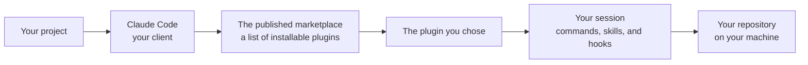

# Technical Partner Guide
<!-- contract: references/package-contract-06-public.md#technical-partner-guide -->

Every statement in this guide maps to an approved claim backed by a verified evidence row. Where a claim is only true within a scope, the scope is stated next to it rather than in a footnote.

## What this is

The marketplace publishes eight Claude Code plugins. *Each entry's advertised version is checked against its source in continuous integration.* The published `main` manifest carries all eight entries.

Six plugins are versioned in this repository. Two are published from other repositories, each pinned to a commit sha. *The manifest uses three resolution mechanisms: six relative paths, one `github` source, one `git-subdir` source.*

## How an integration fits together



## Supported use cases

| Use case | What it enables | Supported | Not supported |
|---|---|---|---|
| Installing a plugin into Claude Code | A worked-out method, its commands, and its safety hooks become available in your sessions | yes | Any client other than Claude Code, except the packaged skill export for Claude Desktop |
| Reading the source before trusting it | Every executable artifact ships as plain text you can read | yes | Signature or checksum verification — none is published |
| Pinning to a specific version | In-repository plugins resolve to the commit your client reads, and both externally sourced plugins are pinned to a commit sha | yes | — |
| Running on macOS or Linux | bash 3.2 and later | yes | **Windows** — see Known limitations |

## Prerequisites and access

| Step | What it is | How to obtain | Typical lead time |
|---|---|---|---|
| Claude Code | The client that resolves, installs, and executes every artifact | Anthropic | immediate |
| `git` | Used by the client to fetch the marketplace | preinstalled on macOS and Linux | immediate |
| `jq` | Required by several plugins' helper scripts | package manager | immediate |
| `gh` CLI, authenticated | Required by the GitHub workflow commands | `gh auth login` | minutes |

## Installing

```
claude plugin marketplace add synaptiai/synapti-marketplace
claude plugin install <plugin-name>
```

Add the marketplace, then install individual plugins by name. *Verified on a profile that already had the marketplace registered; a first install on a clean profile has not been observed.*

## What ships in each plugin

The flow plugin ships 32 skills, 23 commands, 9 agents, and 14 hook scripts. *Counts are file counts — a skill directory without a `SKILL.md` is not a skill.*

Both externally sourced plugins are pinned to a commit sha, so two installs performed on different days resolve the same tree.

## Public interfaces

| Interface | Kind | Purpose | Stability | Since version |
|---|---|---|---|---|
| `.claude-plugin/marketplace.json` | discovery manifest | Names every plugin and how to resolve it | stable | 1.0.0 |
| `plugins/*/.claude-plugin/plugin.json` | plugin identity | Name, version, description, licence | stable | 1.0.0 |
| Slash commands | session interface | The visible surface of each plugin | stable per plugin | per plugin |
| Hook registrations | lifecycle interception | Scripts the client runs at defined events | stable per plugin | per plugin |
| Release assets | distribution | Skill packages for Claude Desktop | stable | — |

Helper scripts under each plugin's `bin/` are internal. They are executable and documented, but they carry no stability commitment and may change without notice.

## How it executes on your machine

Plugins run inside your own Claude Code session. The marketplace operates no service and collects no telemetry.

Two of the plugins in this repository register hooks — shell scripts the Claude Code client runs on your machine at defined lifecycle points — and so does the externally sourced agent-capability-standard.

**Hooks execute without you invoking them.** They run with your user privileges, in your shell, with access to whatever you have access to. There is no sandbox.

Two things bound that risk, and you should verify both yourself.

- Every hook ships as plain text you can read before installing. There are no binaries and no bundles.
- The hooks in the flow plugin are restrictive by design — they block destructive commands, force-pushes, and writes containing credential patterns.

## Authentication and authorization

| Scope or permission | Grants | Required for |
|---|---|---|
| none | The marketplace has no accounts, no keys, and no permission model of its own | — |
| Your GitHub auth (`gh`) | Used by the workflow plugins to act on repositories you already control | flow and gh-workflow commands |
| Your Anthropic account | Pays for and executes all model usage the plugins induce | every plugin |

## Versioning and compatibility

| Aspect | Policy |
|---|---|
| Versioning scheme | Semantic versioning per plugin, mirrored into its marketplace entry. The marketplace itself carries a separate version |
| What counts as a breaking change | **Not defined.** No document states what constitutes a breaking change to a skill, a command, or a settings key |
| Supported versions | The current one. No prior version is maintained |
| Deprecation notice period | **None defined.** No plugin has been deprecated or removed to date |
| How changes are announced | GitHub releases and per-plugin CHANGELOGs. There is no announcement channel, mailing list, or status page |

The marketplace has published 63 tags; the most recent release is v4.10.0, dated 2026-09-10.

Every marketplace entry's advertised version is checked against its source in continuous integration, on manifest changes, weekly, and on demand.

Claude Code's plugin client defaults to auto-updating an added marketplace. Changes reach you without your acting, on the client's schedule.

## Behaviour a partner must handle

| Behaviour | What happens | What your integration should do |
|---|---|---|
| Errors | Helper scripts exit `1` for findings and `2` for a usage or infrastructure error. Commands report a blocked state with a stated reason rather than failing silently | Treat a non-zero exit as authoritative; read the emitted `KEY=value` lines |
| Retries | No script retries anything | Re-invoke; every operation is a read or an idempotent write |
| Idempotency | Scaffolding never overwrites an existing file; installs and marketplace syncs are idempotent | Safe to repeat |
| Rate limits | None imposed by the marketplace. GitHub's own limits apply to clone and API traffic | Handle GitHub's limits |
| Timeouts | None. A `PreToolUse` hook blocks your tool call while it runs | Expect blocking behaviour from hooks |
| Pagination | Not applicable | — |

| Code | Meaning | Retryable | What to do |
|---|---|---|---|
| 0 | Success, or no findings | — | Continue |
| 1 | Findings present, or a required condition failed | no | Read the findings and act |
| 2 | Usage error or infrastructure failure | after fixing the call | Fix the invocation |
| 3 | Inconclusive — used where a required judgment is absent rather than failed | no | Obtain the missing judgment |

## Testing your integration

| Facility | What it offers | Differences from production | How to get access |
|---|---|---|---|
| The repository itself | Clone it and run the test suites directly | None — the repository is the artifact; there is no build step | Public |
| flow and dossier test suites | Each plugin ships a runnable suite | Runs against the working tree rather than an installed copy | Public |
| A scratch repository | Install the plugins and exercise the commands against work you do not mind changing | None | Your own |

There is no sandbox environment and no staging marketplace. A scratch repository is the recommended way to evaluate a workflow plugin before pointing it at anything you care about.

## Quality signals

The flow and dossier plugins ship automated test suites — 2336 and 1951 assertions respectively — both passing. *Assertion counts describe the suites, not coverage of the plugins they guard. The macOS results were observed on one machine; the Linux results are GitHub Actions runs.*

Four of the six in-repository plugins ship no automated test suite.

## Security and data responsibility

| Responsibility | Product | Partner |
|---|---|---|
| Auditing what will execute | Ships everything as readable plain text | **Read the hooks and scripts before installing** |
| Isolating execution | Provides no sandbox | Decide what machine and what account you run this on |
| Protecting credentials | Ships no credentials and requires none | Your own keys, in your own environment |
| Model usage cost | Induces it; measures nothing | Set a budget in your Anthropic console |
| Vulnerability reporting | **No private channel exists** | Report publicly, or not at all |

## Operations and support

| Aspect | Detail |
|---|---|
| Support channel | GitHub issues, public |
| Response expectations | **None stated** |
| Escalation path | **None defined** |
| Status page | None |
| Maintenance notification | None |

## Commitments

| Commitment | Applies to | Conditions | Where it is contractually defined |
|---|---|---|---|
| **none** | — | — | Nowhere. There is no contract, no SLA, and no support agreement with anyone |

This is an open-source project published without warranty or commitment.

## Change communication

| Change type | Notice | Channel |
|---|---|---|
| New plugin or version | none in advance | The marketplace manifest and a GitHub release |
| Breaking change | **none — no policy exists** | The same |
| Removal or deprecation | **none — no policy exists** | The same |
| Security fix | none | A commit |

## Known limitations

| Limitation | Effect on your integration | Workaround |
|---|---|---|
| The `main` branch carries no branch protection and no rulesets, so both test workflows are advisory rather than required | Any change reaches installers without a check having to pass, and the client auto-updates by default | Pin your own copy, or review the diff between syncs |
| The dossier plugin's post-merge documentation automation has never been executed end to end. Its components are tested; the assembled behaviour is not | Do not depend on it working until you have run it yourself | Run it once in a scratch repository first |
| Two open issues report that the shipped shell scripts fail under Windows and Git Bash, and neither test workflow runs on Windows | Windows operators should expect failures | Use macOS or Linux |

## Troubleshooting

| Symptom | Likely cause | Resolution |
|---|---|---|
| A script fails with `declare: -A: invalid option` | An older bash than the script expects | The suites forbid bash 4 constructs; report it as a bug |
| A hook never fires | The file lacks the executable bit | Report it — both maintained suites check for this |
| A command cannot find its plugin root | An environment variable the client does not always set | The maintained plugins ship a fallback resolver; report it if you hit it |
| Anything on Windows | Known and unresolved | Use macOS or Linux |
