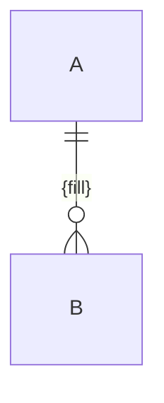

# Data and AI
<!-- contract: references/package-contract-02-architecture.md#data-and-ai -->

Sections that do not apply to this project are marked `N/A` with a reason and supporting evidence. They are not deleted. A project with no persistent data explains how state is handled instead of omitting the data sections; a project with no AI component marks the AI sections `N/A` with the evidence that established it, including what that evidence does not cover.

## Data model

| Entity | Definition | Owning component | Store | Key | Relationships | Evidence |
|---|---|---|---|---|---|---|
| {fill} | {fill} | {fill} | {fill} | {fill} | {fill} | {fill} |

## Stores

| Store | Technology | Data held | Owner | Residency | Classification | Retention | Lifecycle | Evidence |
|---|---|---|---|---|---|---|---|---|
| {fill} | {fill} | {fill} | {fill} | {fill} | {fill} | {fill} | {fill} | {fill} |

## Sources, sinks, and lineage

| Flow | Source | Transformation | Sink | Trigger | Synchronization | Evidence |
|---|---|---|---|---|---|---|
| {fill} | {fill} | {fill} | {fill} | {fill} | {fill — batch \| streaming \| on-demand} | {fill} |

## Consistency, caching, indexing, and search

| Mechanism | Applies to | Behaviour | Staleness window | Invalidation | Evidence |
|---|---|---|---|---|---|
| {fill} | {fill} | {fill} | {fill} | {fill} | {fill} |

| Transactional boundary | Spans | What is not atomic across it | Compensation | Evidence |
|---|---|---|---|---|
| {fill} | {fill} | {fill} | {fill} | {fill} |

## Migrations, backup, restore, archival, deletion, and retention

| Operation | Procedure | Frequency | Last executed | Verified how | Reversible | Evidence |
|---|---|---|---|---|---|---|
| Migration | {fill} | {fill} | {fill} | {fill} | {fill} | {fill} |
| Backup | {fill} | {fill} | {fill} | {fill} | {fill} | {fill} |
| Restore | {fill} | {fill} | {fill} | {fill} | {fill} | {fill} |
| Archival | {fill} | {fill} | {fill} | {fill} | {fill} | {fill} |
| Deletion | {fill} | {fill} | {fill} | {fill} | {fill} | {fill} |

A backup with no evidenced restore is a backup of unknown value, and is recorded that way.

## Analytics and reporting

| Pipeline | Source | Destination | Schedule | Owner | Data classification | Evidence |
|---|---|---|---|---|---|---|
| {fill} | {fill} | {fill} | {fill} | {fill} | {fill} | {fill} |

## Sensitive and regulated data

| Data class | Examples (categories, never values) | Where stored | Where transits | Legal basis | Controls | Evidence |
|---|---|---|---|---|---|---|
| {fill} | {fill} | {fill} | {fill} | {fill} | {fill} | {fill} |

## Data quality

| Control | What it checks | Where it runs | On failure | Coverage gap | Evidence |
|---|---|---|---|---|---|
| {fill} | {fill} | {fill} | {fill} | {fill} | {fill} |

## AI architecture

**Applicability:** {fill — describes the AI component, or `N/A` with the reason and evidence, including what the evidence does not cover}

| Element | Description | Version | Owner | Evidence |
|---|---|---|---|---|
| Models | {fill} | {fill} | {fill} | {fill} |
| Agents | {fill} | {fill} | {fill} | {fill} |
| Prompts | {fill} | {fill} | {fill} | {fill} |
| Tools | {fill} | {fill} | {fill} | {fill} |
| Retrieval | {fill} | {fill} | {fill} | {fill} |
| Memory | {fill} | {fill} | {fill} | {fill} |
| Evaluation | {fill} | {fill} | {fill} | {fill} |

## Model and dataset provenance

| Asset | Origin | License or terms | Permitted uses | Restrictions | Evidence |
|---|---|---|---|---|---|
| {fill} | {fill} | {fill} | {fill} | {fill} | {fill} |

## Lifecycle: training through rollback

| Stage | Process | Trigger | Owner | Artifacts retained | Evidence |
|---|---|---|---|---|---|
| Training | {fill} | {fill} | {fill} | {fill} | {fill} |
| Fine-tuning | {fill} | {fill} | {fill} | {fill} | {fill} |
| Inference | {fill} | {fill} | {fill} | {fill} | {fill} |
| Evaluation | {fill} | {fill} | {fill} | {fill} | {fill} |
| Monitoring | {fill} | {fill} | {fill} | {fill} | {fill} |
| Feedback | {fill} | {fill} | {fill} | {fill} | {fill} |
| Rollback | {fill} | {fill} | {fill} | {fill} | {fill} |

## AI risk controls

| Risk | Exposure in this system | Control | Implemented \| policy-only \| planned \| unknown | Tested | Evidence |
|---|---|---|---|---|---|
| Prompt injection | {fill} | {fill} | {fill} | {fill} | {fill} |
| Data leakage through model or logs | {fill} | {fill} | {fill} | {fill} | {fill} |
| Unsafe or harmful output | {fill} | {fill} | {fill} | {fill} | {fill} |
| Excessive autonomy | {fill} | {fill} | {fill} | {fill} | {fill} |
| Model drift | {fill} | {fill} | {fill} | {fill} | {fill} |
| Human oversight | {fill} | {fill} | {fill} | {fill} | {fill} |

## Model limitations, cost, latency, and vendor dependency

| Aspect | Current state | Measured or estimated | Fallback | Evidence |
|---|---|---|---|---|
| Known limitations | {fill} | {fill} | {fill} | {fill} |
| Cost per unit of work | {fill} | {fill} | {fill} | {fill} |
| Latency | {fill} | {fill} | {fill} | {fill} |
| Vendor dependency | {fill} | {fill} | {fill} | {fill} |

## Reproducibility and versioning

| Artifact | Versioning scheme | Pinned where | Reproducible from | Evidence |
|---|---|---|---|---|
| {fill} | {fill} | {fill} | {fill} | {fill} |
